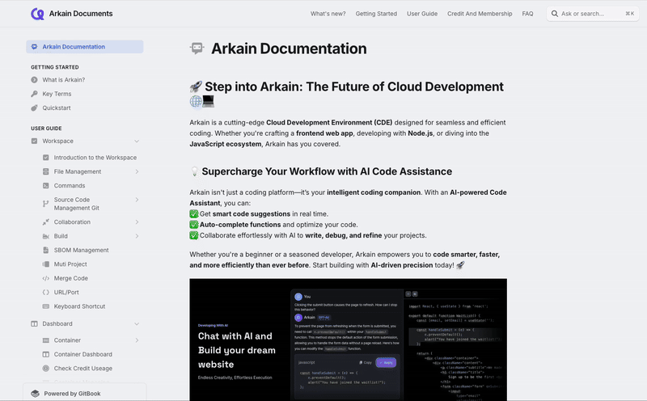

# Arkain Documentation

## 🚀 **Step into Arkain: The Future of Cloud Development**

Arkain is a cutting-edge **Cloud Development Environments (CDEs)** designed for seamless and efficient coding. Whether you're crafting a **frontend web app**, developing with **Node.js**, or diving into the **JavaScript ecosystem**, Arkain has you covered.

### 💡 **Supercharge Your Workflow with AI Code Assistance**

Arkain isn't just a coding platform—it’s your **intelligent coding companion**. With an **AI-powered Code Assistant**, you can:\
✅ Get **smart code suggestions** in real time.\
✅ **Auto-complete functions** and optimize your code.\
✅ Collaborate effortlessly with AI to **write, debug, and refine** your projects.

Whether you're a beginner or a seasoned developer, Arkain empowers you to **code smarter, faster, and more efficiently than ever before**. Start building with **AI-driven precision** today! 🚀

<figure><figcaption></figcaption></figure>

### ✨ **Why Arkain?**

🔹 Build **JavaScript** web apps effortlessly.\
🔹 Power up **Python** for data science & AI.\
🔹 Develop robust **Java** & **Go** system applications.

With Arkain, you get **all the tools you need** to code smarter, faster, and from anywhere. **Start building now!** 🚀

***

### ✅  User Guide

<table data-card-size="large" data-view="cards" data-full-width="false"><thead><tr><th></th><th data-hidden></th><th data-hidden data-card-cover data-type="files"></th><th data-hidden></th><th data-hidden data-card-target data-type="content-ref"></th></tr></thead><tbody><tr><td><strong>Studio</strong></td><td>What is Arkain?</td><td><a href=".gitbook/assets/Group 58.png">Group 58.png</a></td><td></td><td><a href="broken-reference">Broken link</a></td></tr><tr><td><strong>Dashboard</strong></td><td>Share your docs online</td><td><a href=".gitbook/assets/Group 64.png">Group 64.png</a></td><td></td><td><a href="user-guide/dashboard/">dashboard</a></td></tr><tr><td><strong>Template</strong></td><td>Learn the basics of GitBook</td><td><a href=".gitbook/assets/Group 63.png">Group 63.png</a></td><td></td><td><a href="user-guide/template-communtiy/">template-communtiy</a></td></tr><tr><td><strong>AI Code Assistant</strong></td><td></td><td><a href=".gitbook/assets/Group 62.png">Group 62.png</a></td><td></td><td><a href="user-guide/side-chat-ai-code-assistant/">side-chat-ai-code-assistant</a></td></tr></tbody></table>

***


You can use the **search and question feature** in the top-right corner to get faster answers.


<figure><figcaption></figcaption></figure>

### ✅ More Info.

<table data-view="cards" data-full-width="false"><thead><tr><th></th><th data-hidden></th><th data-hidden data-card-cover data-type="files"></th><th data-hidden></th><th data-hidden data-card-target data-type="content-ref"></th></tr></thead><tbody><tr><td><strong>Credit and Membership</strong></td><td>Learn the basics of GitBook</td><td><a href=".gitbook/assets/Group 61.png">Group 61.png</a></td><td></td><td><a href="broken-reference">Broken link</a></td></tr><tr><td><strong>FAQ</strong></td><td></td><td><a href=".gitbook/assets/Group 59.png">Group 59.png</a></td><td></td><td><a href="faq/faq/">faq</a></td></tr><tr><td><strong>Release Note</strong></td><td></td><td><a href=".gitbook/assets/Group 60.png">Group 60.png</a></td><td></td><td><a href="broken-reference">Broken link</a></td></tr></tbody></table>

***
