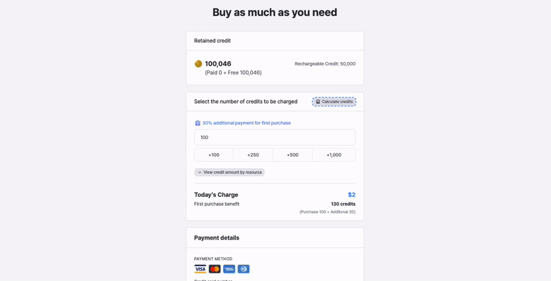

# Credit

## About Credits 💳

Credits are the currency required for using containers. When you use containers, credits are deducted. Here’s what you need to know:

* **Price per Credit**: $0.02 💵
* **Minimum Purchase**: You can purchase credits starting from a minimum of **50 credits**. 🛒

### **Conditions for Credit Deductions ⚠️**

Credits are deducted under the following conditions:

1. **Container Specs**: Deductions occur based on the container specifications while the container is running. For detailed information, refer to the [Container Specifications documentation](../user-guide/dashboard/container/container-specifications.md). 📊
2. **Traffic Usage**: If your container's total traffic exceeds 10GB per month, 10 credits will be deducted for each additional GB of traffic. 🌐
3. **Storage Usage**: If the storage usage of each container exceeds the default capacity, **0.018 credits** will be deducted per **1GB** of storage per hour. Storage is charged regardless of whether the container is running or stopped. 📦
4. **Free Credits**: You are awarded **45 free credits** on the first day of each month, which expire on the last day of the month. ⏳ (Award and expiration times are based on Coordinated Universal Time - UTC.)


**Hint**\
You can monitor network traffic and storage usage for each container in the **Resources monitor** panel at the bottom of the workspace.



***

## 🔢 **Calculate Your Credit Usage** 🚀

Arkain allows you to estimate **credit consumption** based on **performance and usage purpose**. Plan your credits wisely and optimize your service usage efficiently. ⚡

You can check the **Credit Calculator** on the **Billing Page** to get a detailed estimate and ensure you're only using what you need! 💰

* The credit calculator can be accessed from the 'How much credit do I need?' section on the page opened by clicking **\[Pricing]** in the top menu of the Arkain website.
* You can use the credit calculator by clicking **\[Profile]** → **\[Pricing]** at the bottom left of the Arkain dashboard, or by clicking **\[Billing]** → **\[Buy credit]** → **\[Calculate credits]**.

<figure><figcaption>
Calculate Credit Usage
</figcaption></figure>

***

## Purchasing Credits 🛍️

You can purchase credits as needed, starting from a minimum of **50** on the **Payment page**. Follow these steps to charge credits:

1. **Navigate to the Payment Page**: Go to the designated payment section. 🖥️
2. **Enter the Number of Credits**: Specify how many credits you want to purchase. You can use bulk buttons for convenience. ➕
3. **Calculate Credits**: Click the **Calculate credits** button to estimate the amount based on your usage. 📊
4. **Confirm Purchase**: Review the amount of credits and the total payment amount. ✔️
5. **Select Payment Method**: Choose your payment method, enter the required information, and click the **Charge credits** button. 💳

***

## Managing Credits 📋

* **Check Purchased Credits**: You can check your credit balance from the sidebar on the right of the container dashboard, the Billing page, and the credit icon in the workspace ActivityBar. 📊
* **Monthly Usage Report**: Access the **Credit Usage page** to review your monthly credit usage report. This helps you manage your credit payments efficiently. 📅
  * **The Credit Usage page** can be accessed by clicking **\[Profile]** → **\[Billing]** → **\[View usage]** in the dashboard.

***

## How Credits Are Calculated 🔍

This is a forecasting tool that provides an approximate cost based on your specified project or usage. However, the forecasted cost may differ from the actual cost due to various factors:

1. **Duration**: Assumes **720 hours** per month and does not account for leap years. ⏲️
2. **Promotional Credits**: Does not include promotional credits or discounts. 🎉
3. **Additional Charges**: Does not account for additional usage not included in the forecast (e.g., if you use more than **5GB** of storage on the Free plan, you pay **0.018 credits** per GB per hour). ⚠️
4. **Currency**: Forecasts are based on a fixed exchange rate. 💱

### Credit amount by resource 

**General Containers**

<table><thead><tr><th>Container Type</th><th width="115">vCPU</th><th>Memory</th><th>Cost per Hour (Credits)</th></tr></thead><tbody><tr><td>Micro</td><td>0.5</td><td>1 GB</td><td>2.25 credits/hour</td></tr><tr><td>Small</td><td>2</td><td>2 GB</td><td>5.25 credits/hour</td></tr><tr><td>Medium</td><td>4</td><td>4 GB</td><td>9.75 credits/hour</td></tr><tr><td>Large</td><td>8</td><td>8 GB</td><td>18.75 credits/hour</td></tr></tbody></table>

**GPU Containers**

<table><thead><tr><th>Container Type</th><th width="115">vCPU</th><th>Memory</th><th>Cost per Hour (Credits)</th></tr></thead><tbody><tr><td>Basic</td><td>3.5</td><td>13 GB</td><td>13.2 credits/hour</td></tr></tbody></table>

**Additional Charges**

| Type             | Cost per Hour (Credits)                                 |
| ---------------- | ------------------------------------------------------- |
| Traffic Addition | 10 credits per 1 GB for usage exceeding 10 GB per month |
| Storage Addition | 0.018 credits per 1 GB per hour                         |

***

📖  Credit terms

* This policy constitutes part of the[ Arkain](https://accounts.goorm.io/terms) Terms of Service, and any matters not specified in this policy shall be governed by the terms and conditions of the Arkain Terms of Service.

- By paying for Arkain credits, you are deemed to have agreed to the paid service agreement.

* Members may withdraw their subscription within 7 days from the date of subscription. However, if the contents of the contract are different from the contents displayed or advertised by the company or if the contents of the contract are different from the contents of the contract, the subscription may be withdrawn within 1 month from the date of subscription or within 14 days from the date on which the fact was known or could have been known.

- Arkain may provide credits to members based on promotions or members’ activity history, and the conditions and details of credit provision will be announced separately through Arkain.

* If a member’s service is restricted or the member withdraws due to the member’s fault, the remaining credits will be forfeited and the member cannot claim repayment or compensation for the forfeited credits. However, if the member’s service restriction is lifted, the credits will not be forfeited.

- Arkain may change the price of credits at any time and will not compensate members for any loss caused by the changed price.

