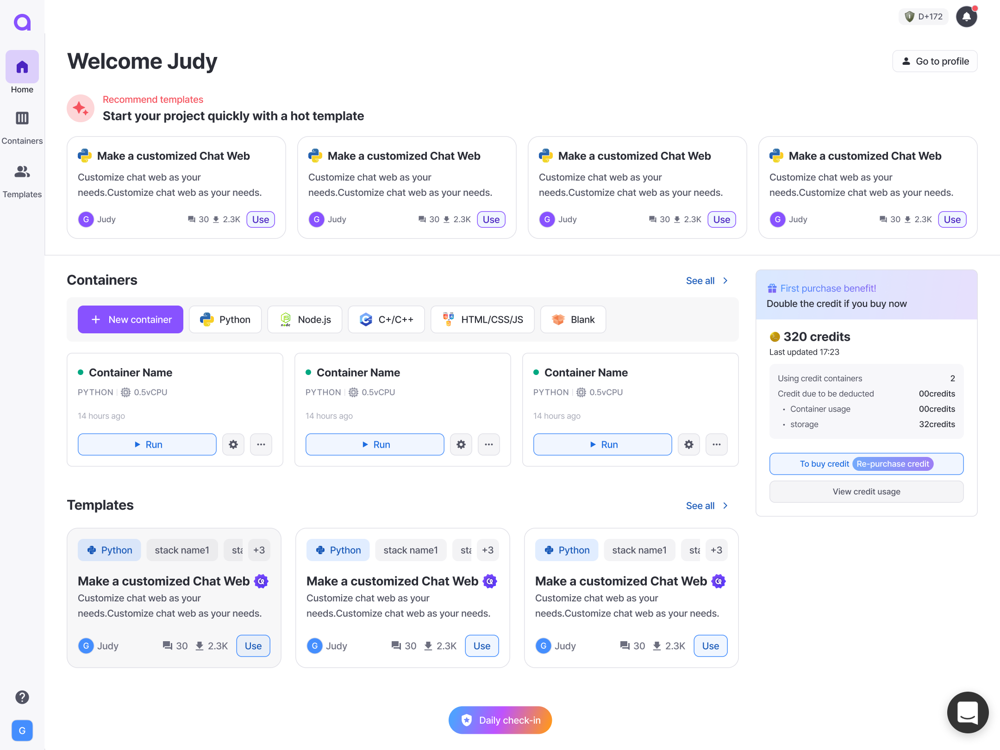

# Dashboard

## Dashboard 🖥️

The **Dashboard** is where you can manage your development environments, created and owned by you. Here's everything you need to know to get started.

<figure><figcaption></figcaption></figure>

## **What Can You Do on the Dashboard?**

1. **View Your Containers** 🧐
   * See a list of all containers you’ve created or own.
   * Quickly view their statuses, configurations, and more.
2. **View** **Templates 🖼️**
   * Check out the popular templates.
   * See a list of templates you've created.
3. **Manage Your Containers** 🔧
   1. Create your container
   2. Modify your container information
      * Update container information, resources, and other options directly.
   3. Delete your container
      * Remove any containers you no longer need.
4. **Check Your Credit** 🪙
   * Buy a credit for using the container.
   * Check the credit usage you used.

## **How to Access Your Dashboard**

* Log in to your Arkain account.
* Navigate to the **Container Dashboard** section from the main menu.

## **Tips for Managing Containers**

* **Organize Your Workspaces** 🗂️: Give each container a clear and descriptive name to easily find them later.
* **Clean Up Regularly** ✨: Delete unused containers to keep your workspace tidy and efficient.

***

Feel free to let me know if you'd like more details or adjustments!
