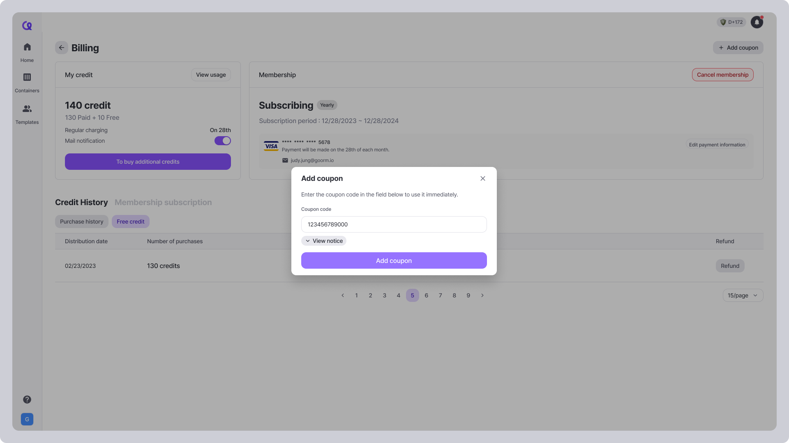

# Coupon

<figure><figcaption></figcaption></figure>

### How to add coupon

1. Visit the [Billing page](https://arkain.io/my/dashboard#/billing).
2. Click the **\[+Add coupon]** button.
3. Enter the coupon code and click the **\[Add coupon]** button.

### Add coupon policy

* If you register your Membership coupon during your membership subscription, the next payment date will be extended.
* If you register your multiple Membership coupon, the membership expiration date will be extended.
* If you register your Credit coupon, the credit will be paid immediately.
* Once your membership expires, you will no longer be able to use the credits provided as a membership benefit.
