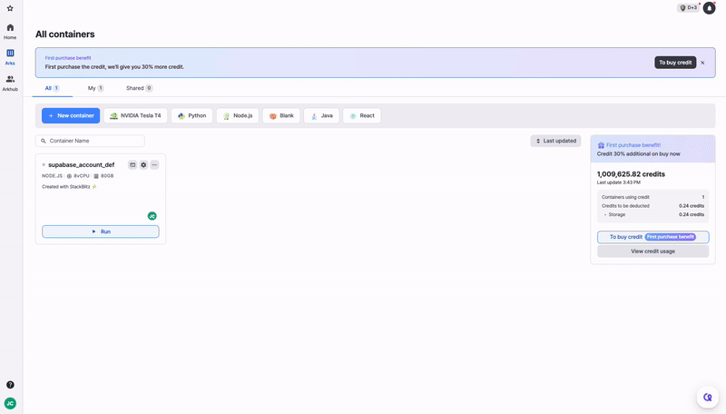

# Check Credit Usage

<figure><figcaption></figcaption></figure>

You can check your credit usage by clicking **\[Profile]** → **\[Billing]** at the bottom left of the dashboard, and then clicking **\[View usage]** next to My credit on the opened billing page.

## 📘 **Credit Usage Guide**

The Credit Usage page provides an overview of your current credit consumption and detailed resource usage. Below is a description of each section:

***

<figure><figcaption></figcaption></figure>

### **1. Total Usage**

* Displays the total amount of credits consumed during the current month.

### **2. Per resource**

* Breaks down credit consumption based on resource types:
  * **Container**: Credits used for running containers.
  * **Storage**: Credits consumed for storing data.
  * **Traffic**: Credits used for data transfer and traffic.

<figure><figcaption></figcaption></figure>

