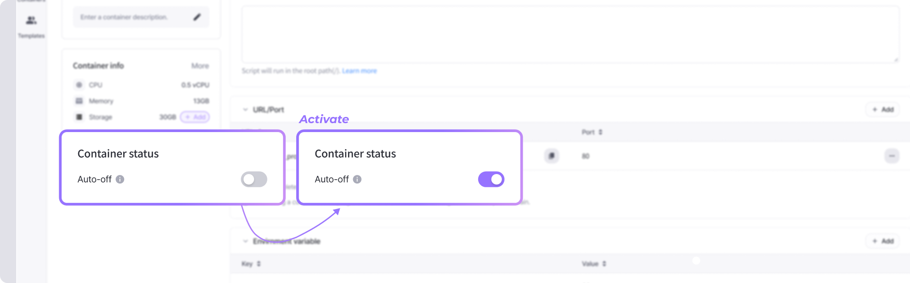

# Auto-off

**Auto-off** shuts down containers after 30-40 minutes when the container's owner closes all Workspace browsers. This feature prevents unnecessary credit use and allows you to use the service more efficiently.

## Feature Guide 

When **Auto-off** is **On**;

* **Auto-off**: The container will automatically shut down 30-40 minutes after all browsers are closed. No credits are deducted after that.
* **Owner-based**: The container owner must close all browsers for **Auto-off** to occur. If you are only using it as a guest, owner should turn off **Auto-off**.
* **Background run**: If you want to keep container running in the background (always-on), you must turn off **Auto-off**.

When **Auto-off** is **Off**;

* **Manual Exit** (stop): The container will continue to run even if you close only browsers. Please manually stop the container by clicking the **\[Container Exit]** button located in the Workspace or the **\[Stop]** button located in the dashboard.
* **Credit use**: If you do not manually stop the container, it will continue to deduct credits. To avoid unnecessary credit use, be sure to exit and stop the container.


**NOTE**\
The **Auto-off** feature works based on all browsers of the container owner being closed. Be sure to turn off **Auto-off** when using guest accounts or background run.


## Set **Auto-off** 

You can set **Auto-off** from the Dashboard and Workspace.

### From Dashboard 

* Click **\[Container Setting]**() button → Active **\[Auto-off]** in Container Status

<figure><figcaption></figcaption></figure>

## From Workspace 

* Click the **\[Auto-off]** button() in the bottom bar, and then click **\[Using feature]** in the popup window to enable the container's auto-off feature.
* To turn off the feature, click the **\[Auto-off]** button() again.

<figure><figcaption></figcaption></figure>

<figure><figcaption></figcaption></figure>
