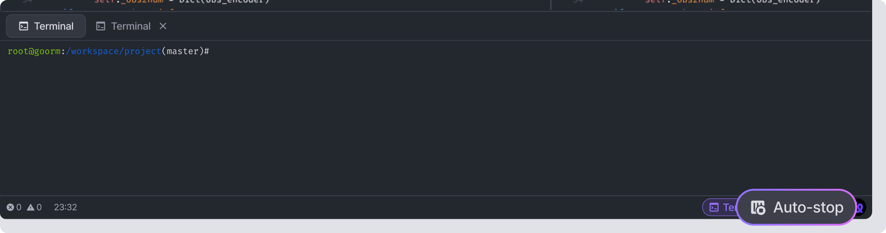

# Auto-stop

**Auto-stop** shuts down containers after 30-40 minutes when the container's owner closes all Workspace browsers. This feature prevents unnecessary credit use and allows you to use the service more efficiently.

## Feature Guide 

When **Auto-stop** is **On**;

* **Auto-stop**: The container will automatically shut down 30-40 minutes after all browsers are closed. No credits are deducted after that.
* **Owner-based**: The container owner must close all browsers for **Auto-stop** to occur. If you are only using it as a member, the owner should turn off **Auto-stop**.
* **Background run**: If you want to keep a container running in the background (always-on), you must turn off **Auto-stop**.

When **Auto-stop** is **Off**;

* **Manual Exit** (stop): The container will continue to run even if you only close the browsers. Please manually stop the container by clicking the **\[Exit]** button located in the Workspace or the **\[Stop]** button located in the Dashboard page.
* **Credit use**: If you do not manually stop the container, it will continue to deduct credits. To avoid unnecessary credit use, be sure to exit and stop the container.


**NOTE**\
The **Auto-stop** feature works based on all browsers of the container owner being closed. Be sure to turn off **Auto-stop** when using member accounts or background run.


## Set **Auto-stop** 

You can set **Auto-stop** from the Dashboard page and the Workspace.

### From Dashboard 

* Click the **\[Settings]**() button of the container → Active **\[Auto-stop]** in Container Status section.

<figure><figcaption></figcaption></figure>

## From Workspace 

* Click the **\[Auto-stop]** button() in the bottom bar, and then click the **\[Using feature]** button in the popup to enable the container's auto-off feature.
* To turn off the feature, click the **\[Auto-stop]** button() again.

<figure><figcaption></figcaption></figure>
