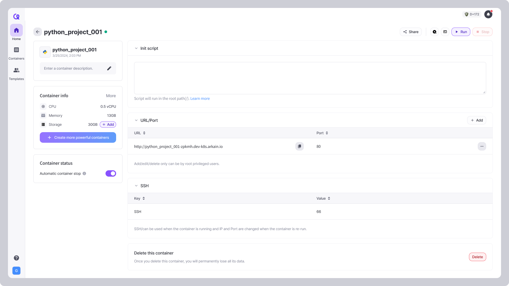

# Container Settings

Click button in the Container Card. You can go to the container **settings page.**

<figure><figcaption></figcaption></figure>

***

### **Container Basics**

Add a description to provide context for what the container is used for. This is especially helpful for collaboration.

### **Container info**

You can check various container information, such as the container's hardware specs including CPU, memory, and storage, as well as the container region, stack and OS.


[container-specifications.md](../../container-specifications.md)


You can also add storage capacity or change the container specs (CPU and memory).

* Add Storage
  * **Default:** 5GB / **Up to:** 200GB
  * **Free Plan**: 5GB for free
  * **Membership Plan**: 30GB for free


You can change settings after stopping the container.



**Check before Adding Storage**

* Once upgraded, storage **cannot be downgraded.**
* You can upgrade again **6 hours after** the previous upgrade.
* If you **exceed your free storage**, **additional charges** will apply based on your usage.


### Share container

You can invite other users to your container with 4 permissions (Readonly, Editable(non-root/root), Editable & sharable(root)). You can also share the container's shared link with other users.


[container-sharing.md](container-sharing.md)


### **Container status**

Save resources by activating the **Auto-off** feature. The container will automatically stop after a period of inactivity, reducing unnecessary costs and improving efficiency.


[auto-off.md](../../auto-off.md)


### **Init Script**

If you have a script that needs to be executed repeatedly when running a container, try the Init script! The Init script runs from the root directory `(/)` of the container and is executed when the container starts.


[init-script.md](init-script.md)


### **URL/Port**

View and manage the unique URL and Port for accessing your running application directly from the browser. Port is crucial for ensuring your application or services can be accessed externally.


[url-port.md](../../../../workspace/url-port.md)


### **7. Environment Variables**

Environment variables are defined as key-value pairs and can be used to store database credentials, API keys, and other sensitive information for applications.&#x20;

By using environment variables, programs can be executed according to the environment without changing the source code, and sensitive security keys do not need to be stored directly in configuration files, enhancing security.


[environment-variable.md](environment-variable.md)


### **8. Delete this container**

You can delete the container by clicking the **\[Delete]** button on the container settings page.

