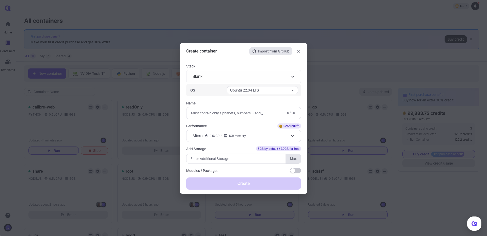

# Creating Container

Go to [Arkain Dashboard](https://arkain.io/my/dashboard), Click the **\[New Container]** button at the top of the page.

<figure><figcaption></figcaption></figure>



**Set Up a Container Stack**

Currently, the supported stacks are **Blank, NVIDIA Tesla T4, Python, Node.js, Java, React and Go**.



**Configure Template and OS**&#x20;

The available OS versions are **Ubuntu 22.04 LTS** and **Ubuntu 20.04 LTS**.


The **NVIDIA Tesla T4** container stack is only available on **Ubuntu 20.04 LTS.**




**Set a Container Name**

Enter a name for your container.


**Note**\
Container names **cannot be changed** once created and must only contain **letters, numbers, underscores (\_), or hyphens (-).**

Once the container is created, the container name cannot be changed.




**Configure Container Specs**

You can check the available container specifications on [this page](https://docs.arkain.io/user-guide/dashboard/container/container-specifications).



**Configure Additional Storage**

* **Default:** 5GB / **Up to:** 200GB
* **Free Plan**: 5GB for free
* **Membership Plan**: 30GB for free



**Activate Additional Modules/Packages**

Install additional modules and packages during container creation to save time.


**Note**

* Once upgraded, storage **cannot be downgraded.**
* If you **exceed your free storage**, **additional charges** will apply based on your usage.




***

With these easy steps, you’re all set to create and customize your container in Arkain! \
Start building smarter and faster today.&#x20;
