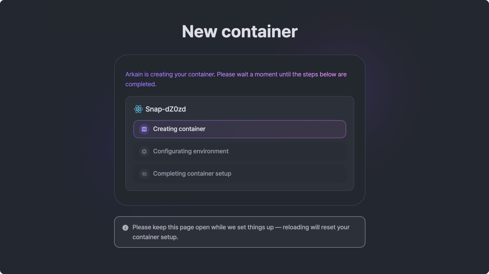
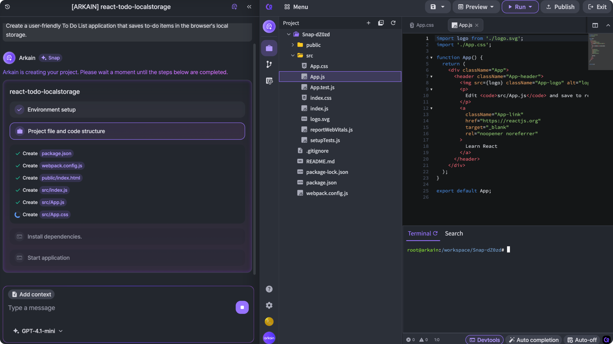

# Using Arkain Snap

[Arkain Snap](../../../../arkain-ai/what-is-arkain-snap.md)  is available on the Dashboard for easy access.


[what-is-arkain-snap.md](../../../../arkain-ai/what-is-arkain-snap.md)


<figure><figcaption></figcaption></figure>

### Enter your prompt

Create a service or app using only natural language prompts.

If you can't think of what to create, click on the **Quick prompts** below the input box and experience Arkain Snap.


The default stack is generated in Node.js, and when you use the Quick Prompt, it is generated with the appropriate stack for that prompt.


### Container creating

After you complete your prompt, a container will be created based on your prompt.

<figure><figcaption></figcaption></figure>

Once the container is created, your workspace is created and the AI agent starts building your service.

Check the service created based on your prompt and use Side Chat's AI to make changes in your service.

<figure><figcaption></figcaption></figure>

