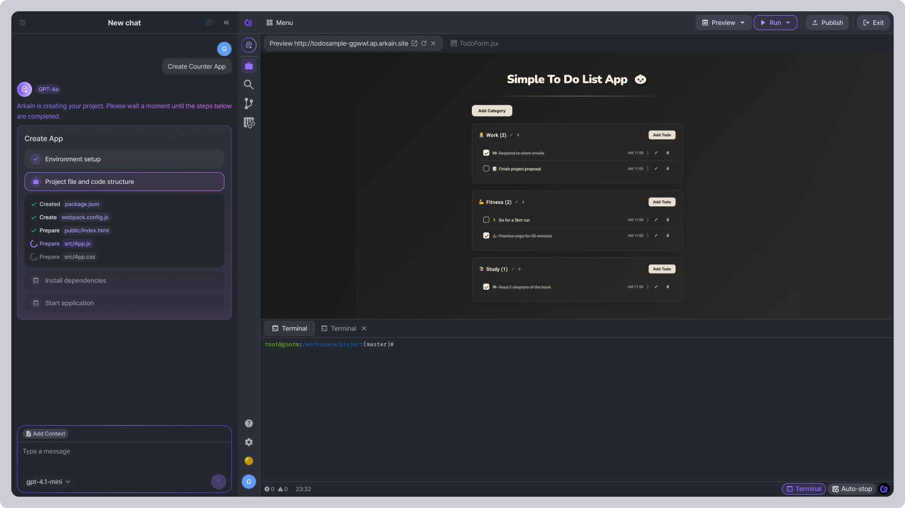

# Using Arkain Snap

**Arkain Snap** is an AI agent that turns ideas into reality. You can create services or apps just with natural language prompts, without needing to learn programming languages anymore.\
There are two ways to use Arkain Snap:

## Start from the Dashboard

[**Arkain Snap**](../../../../arkain-ai/what-is-arkain-snap.md)  is available on the Dashboard page for easy access.

<figure><figcaption></figcaption></figure>



### Enter your prompt

Create a service or app using only natural language prompts.

If you need inspiration, click the **Quick Prompts** below the input box to see what Arkain Snap can do.


By default, a container is generated in Node.js base template, and when you use the Quick Prompt, a container is generated with the appropriate base template for that prompt.




### Container creating

After you complete your prompt, a container will be created based on your prompt.

Once the container is created, your workspace is created and the AI agent starts building your service.



## Start with a Specific Base Template

<figure><figcaption></figcaption></figure>



### Create a Container

Go to the [Arkain Dashboard](https://arkain.io/my/dashboard), click the **\[New container]** button and create a container by following the instuctions on [this page](./).


Arkain Snap is available with **Python, Node.js, Java, React, and Go** Containers.




### Run the Container and Enter Your Prompt

After the container is created, click the **\[Run Container]** button. On the first run, Arkain Snap will appear inside your container.

Describe your idea in natural language in the input box, then click the **\[Generate with Arkain Snap]** button.



### Build the Project

Arkain Snap will automatically:

* Configure the environment for the selected base template and your project.
* Generate the project structure and code.
* Install dependencies and start the application.


**Note**

* If a command fails to run, click the **\[Run]** button in the top-right corner of the Workspace to re-execute it.
* The success or failure of the command will be shown at the bottom of the code block as **"Success"** or **"Failed building the project"**.




## Preview the Result

<figure><figcaption></figcaption></figure>

Once Arkain Snap finishes building the project, the **Preview** will automatically open in your Workspace so you can test the app right away. Check the service created based on your prompt and use the **Side Chat** to make changes to your service.
