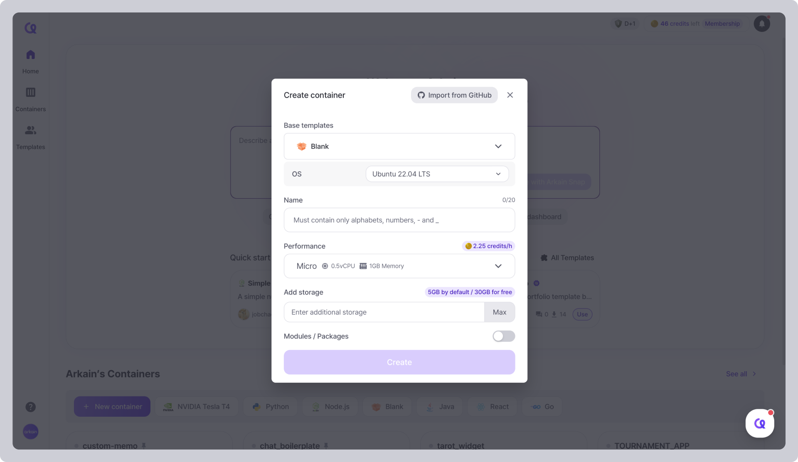

# Import GitHub Repos

You can import a project from a **GitHub repository** and continue working on it in Arkain.



### **Go to the** [**Dashboard**](https://ide.goorm.io/my/dashboard) **and click \[+ New container].** 

<figure><figcaption></figcaption></figure>



### **Authenticate your GitHub account** 

<figure><figcaption></figcaption></figure>

* In the 'Create Container' popup, click the **\[Import from GitHub]** button in the top right corner.
* Click the **\[Github authorization]** button to link your account through GitHub account.
* Upon successful authentication, the list of repositories from the GitHub account will be displayed.



### **Create a container from GitHub repository** 

<figure><figcaption></figcaption></figure>

* Select the repository you want to import. If the repository is set as private, it will be indicated with a badge in the list.
* The software stack and name will be automatically entered based on the selected repository, and you can freely modify them if needed.
* If needed, activate additional modules/packages to install them.
* Lastly, click the **\[Import project]** button to create the container based on the provided information.


