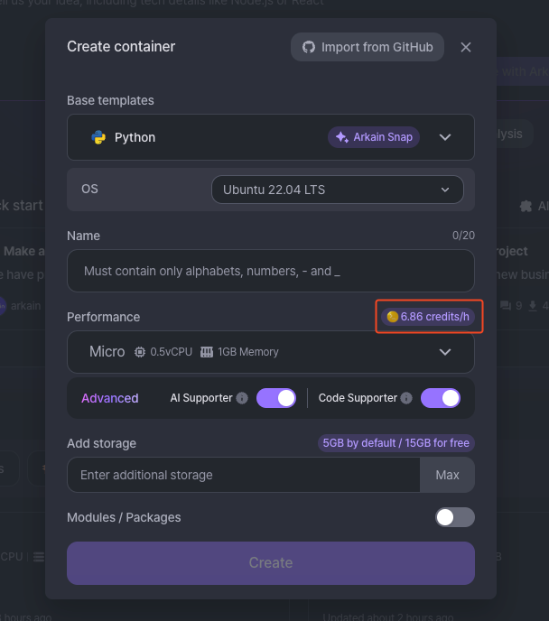

# Configuring Container

## **Arkain Container** Configuring **Guide**

Welcome to Arkain's container settings page! This guide will walk you through all the features and configurations available to help you optimize your development environment. 🚀

***

### **1. Container Basics**

* **Description**\
  Add a description to provide context for what the container is used for. This is especially helpful for collaboration.

### 2**. Container info**

* You can check various container information, such as the container's hardware specs including CPU, memory, and storage, as well as the container region, stack, OS, template, and packages.
* You can also add storage capacity or change the container specs (CPU and memory).


Only membership users can increase the container storage capacity up to 195GB. Free users cannot add storage capacity.


### 3**. Container status**

* **Automatic container stop**\
  Save resources by activating the auto-shutdown feature. The container will automatically stop after a period of inactivity, reducing unnecessary costs and improving efficiency.
* **CONTAINER VISIBILITY**\
  Determine the access level of your container. Make it **\[Public]** for open collaboration or **\[Private]** for restricted access within your team.

<figure><figcaption></figcaption></figure>

* **TOOLS**\
  You can choose the IDE environment to use in the workspace. By default, the Arkain IDE is launched, but you can also use Visual Studio Code, Jupyter Notebook, or Jupyter Lab development environments as needed.


Regularly update your container settings to match the evolving needs of your project. With Arkain’s flexibility, you can ensure a smooth and productive development experience every step of the way! 🌟


### **4. Init Script**

* If you have a script that needs to be executed repeatedly when running a container, try the Init script! The Init script runs from the root directory `(/)` of the container and is executed when the container starts.


[init-script.md](init-script.md)


### **5. URL/Port**

* View and manage the unique URL and Port for accessing your running application directly from the browser. Port is crucial for ensuring your application or services can be accessed externally.

### **6. SSH/Port Forwarding**

* Set up secure shell (SSH) access to your container for remote management or troubleshooting.


[ssh-port-forwarding-configuration.md](../../../../../faq/faq/ssh-port-forwarding-configuration.md)


### **7. Environment Variables**

* Environment variables are defined as key-value pairs and can be used to store database credentials, API keys, and other sensitive information for applications.&#x20;
* By using environment variables, programs can be executed according to the environment without changing the source code, and sensitive security keys do not need to be stored directly in configuration files, enhancing security.


[environment-variables.md](environment-variables.md)


### **8. Delete this container**

* You can delete the container by clicking the **\[Delete]** button on the container settings page.

### **9. Etc**

* **Upgrade Container Performance**\
  Adjust the resources allocated to your container, such as CPU and memory, to handle more demanding tasks or improve application performance.


[container-upgrade.md](container-upgrade.md)


