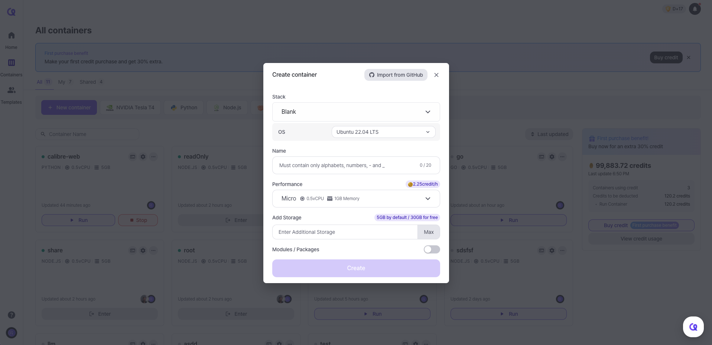

# Creating Container

Go to [Arkain Dashboard](https://arkain.io/my/dashboard), Click the **\[New Container]** button at the top of the page.

<figure><figcaption></figcaption></figure>

❶ Set Up a Container Stack. Currently, the supported stacks are **Blank, NVIDIA Tesla T4, Python, Node.js, Java, React and Go**.

❷ Configure Template and OS. The available OS versions are **Ubuntu 22.04 LTS** and **Ubuntu 20.04 LTS**.


The **NVIDIA Tesla T4** container stack is only available on **Ubuntu 20.04 LTS.**


❸ **Set a Container Name.** Enter a name for your container.


**Note**\
Container names **cannot be changed** once created and must only contain **letters, numbers, underscores (\_), or hyphens (-).**

Once the container is created, the container name cannot be changed.


❹ Configure Container Specs. The available container specifications can be found on the following page.


[container-specifications.md](../container-specifications.md)


❺ Configure Additional Storage.&#x20;

* **Default:** 5GB / **Up to:** 200GB
* **Free Plan**: 5GB for free
* **Membership Plan**: 30GB for free


Note

* Once upgraded, storage **cannot be downgraded.**
* If you **exceed your free storage**, **additional charges** will apply based on your usage.


❻ Activate Additional Modules/Packages. Install additional modules and packages during container creation to save time.

***

With these easy steps, you’re all set to create and customize your container in Arkain! \
Start building smarter and faster today.&#x20;
