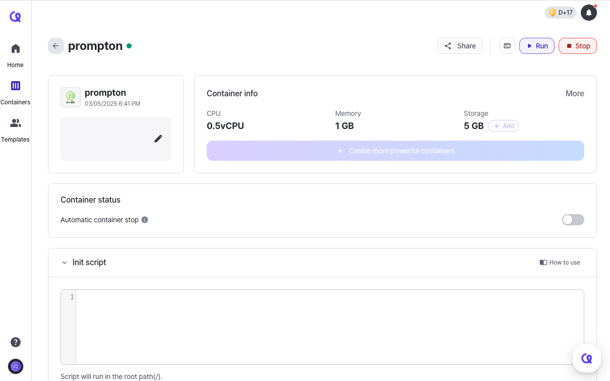

# Sharing Container

You can share your container with others to collaborate or showcase your projects. Even if someone doesn't have a Arkain account, they can still access the shared container.

Click the **\[Setting]** button (.png>)) of the container you want to share on the Arkain's Dashboard. In the Container Settings page, click the **\[Share]** button () at the top-right corner.

<figure><figcaption></figcaption></figure>

There are two ways to share containers:

### 1. **Share with Members**



**Enter the email address** of the user you want to invite to the container.

The user's email **must be the email registered with Arkain.**

<figure><figcaption></figcaption></figure>



**Select permissions** to access the container.

<table><thead><tr><th width="241">Permission</th><th>Possible actions</th></tr></thead><tbody><tr><td>Readonly</td><td>-</td></tr><tr><td>Editable (non-root)</td><td>-</td></tr><tr><td>Editable (root)</td><td><ul><li>Configuring init script, URL/Port, Environment Variable</li></ul></td></tr><tr><td>Editable &#x26; sharable (root)</td><td><ul><li>Configuring init script, URL/Port, Environment Variable</li><li>Sharing Container</li><li>Changing member permissions</li></ul></td></tr></tbody></table>



Click the **\[Invite]** button to share the container with the selected user.



### 2. **Share with Link**



Set the sharing scope and permissions above the Members list for the link.

If you set the sharing scope to `Invited user`, only members who have been invited to the container will be able to access the container using the link. On the other hand, if you select `Anyone with a link`, any user can access the container using the link , even if they are not a member of the container.



Share the link with the users who you want to invite.



Users who access the container through the shared link will receive access to the container based on the sharing link settings.



Also, you can share a Container from the Workspace Settings


[contaienr-sharing.md](../../../../workspace/collaboration/contaienr-sharing.md)


