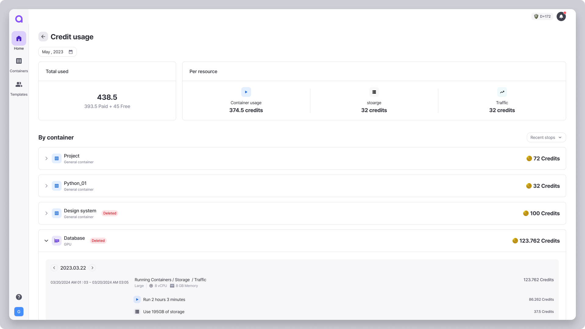

# Credit Usage

<figure><figcaption></figcaption></figure>

You can check your credit usage by clicking **\[View credit usage]** button at the right of the dashboard.

***

## **How to Use the Usage Page**

The **Credit Usage page** provides an overview of your current credit consumption and detailed resource usage. Below is a description of each section:

<figure><figcaption></figcaption></figure>

### **1. Total Usage**

* Displays the total amount of credits consumed during the current month.

### **2. Per resource**

* Breaks down credit consumption based on resource types:
  * **Run Container**: Credits used for running containers.
  * **Storage**: Credits consumed storage capacity allocated to the container.
  * **Traffic**: Credits used for data transfer and traffic.

<figure><figcaption></figcaption></figure>

### 3. Usage per container

* Shows a log of credits charged per container on a set date.
  * Check the log by changing the date by day.
* You can view the resource usage that led to container credit charges.


How to calculate credit usage

* Credit will be deducted when the container is terminated.
* If a container is in use and terminates with no credits remaining, the value of credits shown on the Usage page might be greater than the actual value deducted because the time when credits are deducted and the time when the container actually terminates might be different.


