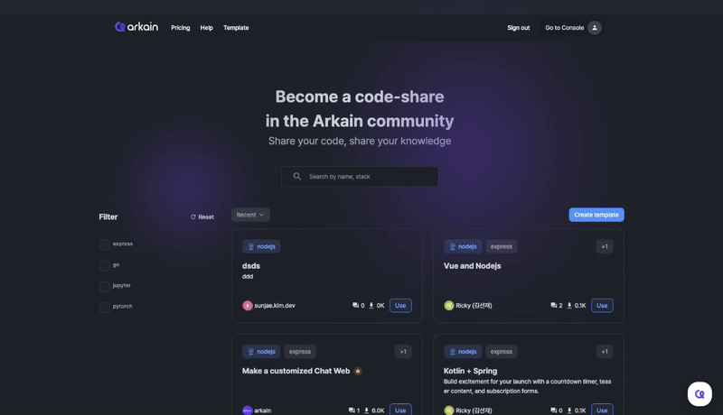

# Create Template

## How to Create a Template in the Template Community 🌟

Creating a template in the **Template Community** allows you to share your project setup with others and make development faster and easier for the community. Here’s how to create and share your own template:

<figure><figcaption></figcaption></figure>

***

## **Steps to Create a Template**

### **1. Access the Template Creation Page**

* Navigate to the **Template Community** section from your dashboard.
* Click on the **Create Template** button in the top-right corner.

***

### **2. Fill in Template Details**

#### **1. Template Name**

* Enter a descriptive name for your template.
* The name should clearly indicate the purpose or technology used (e.g., "React Starter Template" or "Python Flask API").

#### **2. Description**

* Provide a detailed description of your template, including:
  * Features it includes.
  * Technologies or frameworks used.
  * Specific use cases (e.g., "Ideal for quick REST API development").

#### **3. Language/Framework**

* Specify the programming language and framework used in the template.
* You can select multiple options if applicable.

***

### **3. Review and Publish**

* Double-check all details, especially file structures and descriptions.
* Click **Publish Template** to share it with the community.

***

### **Best Practices for Template Creation**

1. **Keep it Clean and Simple**
   * Avoid unnecessary files or configurations to keep the template lightweight.
2. **Provide Clear Documentation**
   * Include a `README` file to guide users on how to use the template effectively.
3. **Test Before Publishing**
   * Ensure your template is fully functional and error-free.
4. **Keep it Updated**
   * Periodically update your template to reflect new features or framework versions.

***

By creating a template, you contribute to a collaborative and efficient development community. Start building your template today and share your expertise with the world! 🌐✨
