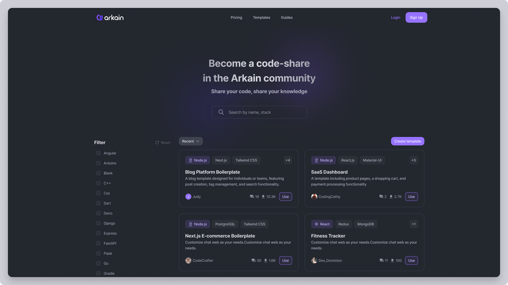

# Create a Template

## How to Create a Template in the Template Community 🌟

Creating a template in the **Template Community** allows you to share your project setup with others and make development faster and easier. Here’s how to create and share your own template:

<figure><figcaption></figcaption></figure>

***

## **Steps to Create a Template**


Please note that Arkain's template content only supports English.


### **1. Access the Template Creation Page**

There are three ways to create it:

* Click the **\[Create template]** button on the Template page.
* Click the **\[More(****)] > \[Publish to template]** button on the Container card within the **Dashboard** **page**.
* Click the \[Publish] button located at the top of the **Workspace**.

***

###

<figure><figcaption></figcaption></figure>

### **2. Fill in Template Details**

#### **2.1**  Select Your Container

* Select the container to publish as a template.
* Template creation in GPU containers is not yet supported.

#### **2.2 Enter Your Template Name**

* Write a name that will make your template stand out.
* We recommend that the name clearly reflect the purpose or technology being used (e.g., "React Starter Template" or "Python Flask API").

#### **2.3 Description**

* Provide a detailed description of your template
  * Specific use cases (e.g., "A simple example using OpenWeatherMap API and The Solar System OpenData API.").
  * Description can be up to 280 characters long.

#### **2.4 Stack**

* Please enter the technology stack used in the container. You can add up to 10 items.

#### **2.5 Recommended Spec**

* Please select the Recommended Spec.&#x20;
*   You can choose one of the following:&#x20;

    * Micro (0.5vCPU, 1GB Memory)
    * Small (2vCPU, 2GB Memory)
    * Medium (4vCPU, 4GB Memory)
    * Large (8vCPU, 8GB Memory)

Click **\[Temporary save]** to save temporarily, or click **\[Next]** to proceed to the next step.


Please note that **only one Temporary save is possible.**


***

<figure><figcaption></figcaption></figure>

### **3. D**etailed description of the template.

* Please provide a detailed description of your template.&#x20;
* We recommend including the following:
  * **Overview**: Describe the main function or purpose of the template. Also add the intended audience, expected benefits, and examples of its use.
  * P**review**: Add preview images of the result screen, code structure, or key features after the template is run.
  * Features: List the Key Features.
  * Requirements: Lists the environment and tools required to run this template.
* If it's difficult to write, please refer to the sample document provided on this page.

***

###

<figure><figcaption></figcaption></figure>

### **4.** Create a Template.

* The template creation process is complete. Please review the content you've written, and if everything is correct, click the **\[Create]** button.
* Before template creation begins, make sure the following is met:
  * Don't you have a file like a password?
  * Is it possible to run the template right away?
  * Is there any file that would violate the security?


Note

* **When a template is created, any containers running will be terminated.**
* Templates are created after a **security review process.**&#x20;
* If the container has **a large file size** or the security review process takes a long time, template creation **may take a long time.**



Note

If your template **fails to create**:

1. **Click your failed template.**
2. **Check fail reasons**&#x20;
   1. If a file contained in the container is causing the issue, click the   button to run the container and resolve the issue.
   2. If you are having trouble solving the problem, please contact us.
3. If you have resolved the cause, Click the **\[Re-create]** button.


***

### **Best Practices for Template Creation**

1. **Keep it Clean and Simple**
   * Avoid unnecessary files or configurations to keep the template lightweight.
2. **Provide Clear Documentation**
   * Include a **README.md** file to guide users on how to use the template effectively.
3. **Test Before Publishing**
   * Ensure your template is fully functional and error-free.
4. **Keep it Updated**
   * Periodically update your template to reflect new features or framework versions.

***

By creating a template, you contribute to a collaborative and efficient development community. Start building your template today and share your expertise with the world! 🌐✨
