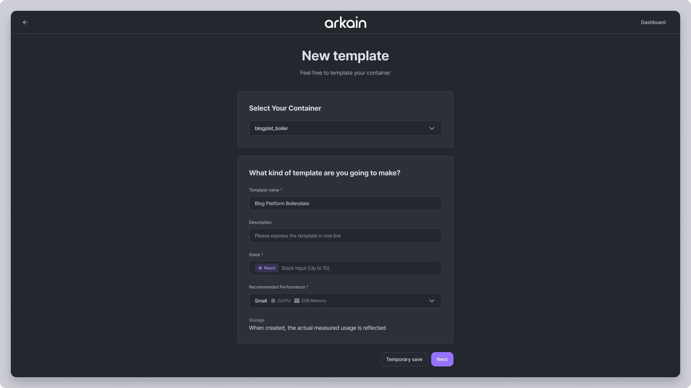
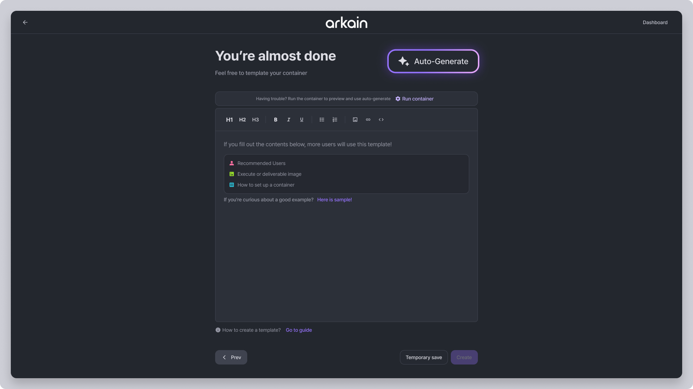

# AI-Generated Template Introduction

During the template introduction step, the AI-Generated Template Introduction analyzes your code and automatically suggests an introduction.

AI reads your code and summarizes the template's features, allowing you to quickly draft text without manually writing the introduction.

#### Step-by-Step



Access the 'Create Template' page. Enter the template name and select specifications, then click the **\[Next]** button.

<figure><figcaption></figcaption></figure>



Click the **\[Auto-Generate]** button to generate a template introduction.

<figure><figcaption></figcaption></figure>



Your template introduction will be automatically generated using AI.

<figure><figcaption></figcaption></figure>

<figure><figcaption></figcaption></figure>




**Important Notes when Using AI-Generated Template Introduction**

* The container must be running before you can use the AI-Generated Template Introduction.
* If your container doesn’t have enough content, Arkain will display the default introduction instead.

