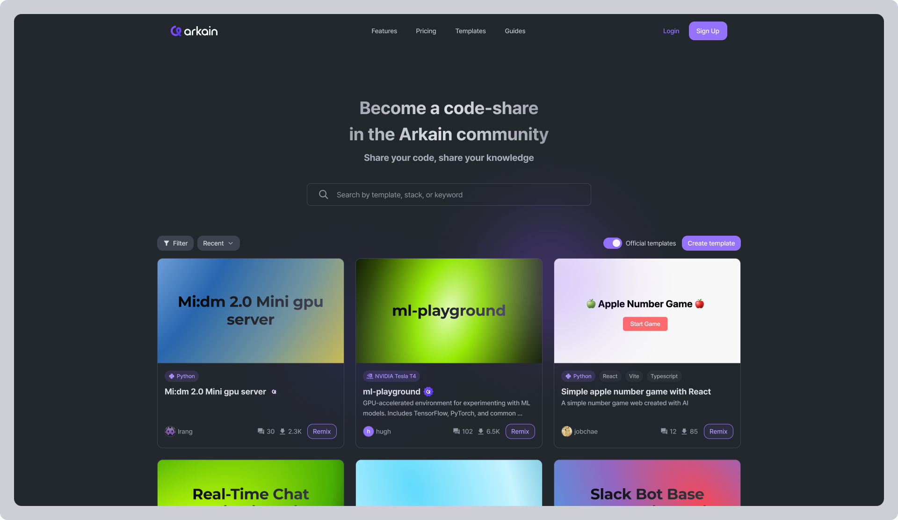

# AI-Generated Template Introduction

During the template introduction step, the **AI-Generated Template Introduction** analyzes your code and automatically suggests an introduction.

The AI reads your code and summarizes the template's features, allowing you to quickly draft text without manually writing the introduction.

#### Step-by-Step



Access the **'Create Template' page**. Enter the template name and fill in the details, then click the **\[Next]** button.

<figure><figcaption></figcaption></figure>



Click the **\[Auto-Generate]** button to generate a template introduction.



Your template introduction will be automatically generated using the AI.




**Important Notes when Using AI-Generated Template Introduction**

* If your container is stopped, it will be started automatically when you use this feature.
* Your container will remain running after the introduction is generated. To avoid additional charges, stop the container manually when you're done.
* If your container has insufficient content, the default introduction will be displayed instead.

