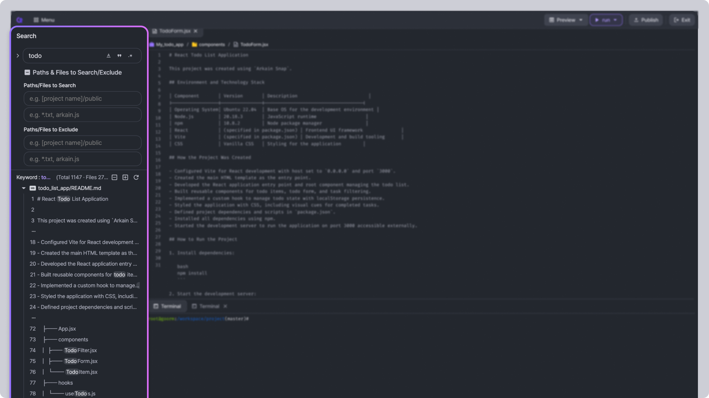
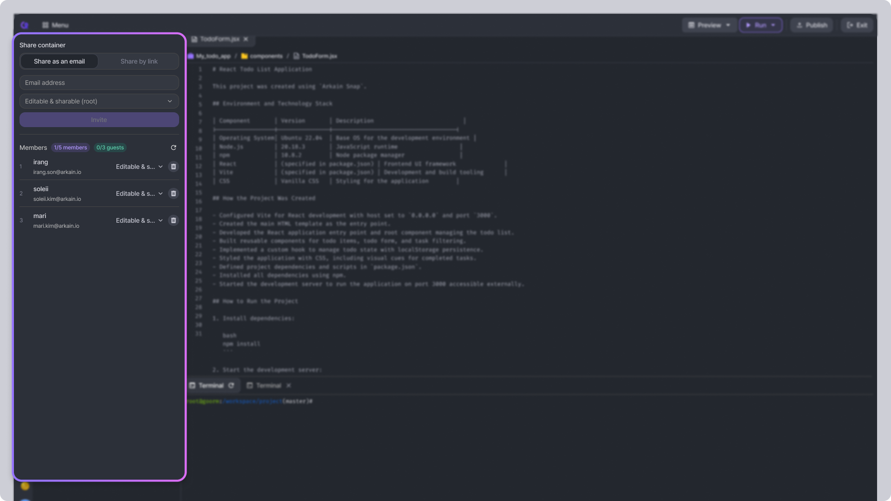
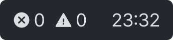

# Workspace

Arkain's **Workspace** is an IDE (Integrated Development Environment) designed to help you efficiently develop software. It provides features such as editing, building, testing, and deploying software. The main components of the Workspace are as follows.&#x20;

<figure><figcaption></figcaption></figure>

***

## Menu bar 

<figure><figcaption></figcaption></figure>

The Menu bar is where you perform general operations on your Arkain Workspace. It includes the following buttons, from left to right

* The **\[Menu]** button() allows users to access the **Process List**, **SSH Configuration**, **Manage SBOM**, and **New Terminal Window**.

<figure><figcaption></figcaption></figure>

* The **\[Preview]** button() allows users to preview their project within the Workspace or in a new tab. It also provides options for configuring the execution URL and port settings.

<figure><figcaption></figcaption></figure>

* The **\[Run]** button () allows users to manage and execute custom run commands.


[commands.md](commands.md)


<figure><figcaption></figcaption></figure>

* The **\[Publish]** () button deploys the currently active container as a template. Deployed templates are made public on the [Templates page](https://arkain.io/template).
* Clicking the **\[Exit]** button () exits the Workspace.

<figure><figcaption></figcaption></figure>


**Warning**

\
Even if you close the web browser, the container will remain running. **While the container is running,** [**credits**](../../credits-and-membership/credits/) **will be deducted.** To prevent further credit deduction, you must select the **\[Exit container after stopping]** checkbox before clicking the **\[Exit container]** button.


## Sidebar 

The Sidebar is an area that helps you easily access key features needed for development.

### &#x20; [Side Chat](../arkain-ai/)

Clicking on the **\[Side Chat]** button will open a Side Chat on the left side of the Workspace, where you can converse with the **AI Code Assistant**.

<figure><figcaption></figcaption></figure>


Side Chat is only available for the container's **owner**.



[side-chat.md](../arkain-ai/side-chat.md)


###  Project

The **\[Project]** button opens the Project Sidebar area. The project sidebar is a type of file explorer that allows you to create, edit, and delete project files and folders.

You can click on files, such as a README or source code, to open them in the editor.

<figure><figcaption></figcaption></figure>

#### ➕ **Create Files & Folders**

Click the  **button** to create new **files, folders** and sub projects within your project.

#### **Folder Management**

* Use the  **icon** to collapse all folders.
* Click the  **refresh button** to update the file tree and keep it in sync.
* Click the  **more actions button** to access project-level utilities, such as renaming the container, uploading local files or folders, and downloading items from the workspace.

**Right-Click for File Actions**

Right-click on a file to access all available file-related features, including renaming, deleting, moving, and more!&#x20;

<figure><figcaption></figcaption></figure>

###  [Search](search.md)

The **\[Search]** button opens the Search Sidebar area.

Enter a keyword in the input field at the top to view all matching results, grouped by file. This is useful when searching across your entire project.\
Each result displays the file name, line number, and matching content. You can quickly jump to the relevant location by clicking the matching result.

<figure><figcaption></figcaption></figure>


[search.md](search.md)


###  [Git](source-code-management-with-git/git-sidebar.md)

It opens Git, a distributed version control system, in the Sidebar to track and synchronize changes to files. Arkain provides support for most common Git commands.

<figure><figcaption></figcaption></figure>


[git-sidebar.md](source-code-management-with-git/git-sidebar.md)


###  [Share This Container](./#share-this-container-sidebar)

You can share your container with other Arkain users to collaborate or showcase your projects.

<figure><figcaption></figcaption></figure>


[contaienr-sharing.md](collaboration/contaienr-sharing.md)


###  Help

Here, you can find Arkain's features, view [shortcuts](keyboard-shortcut.md), and access help.

<figure><figcaption></figcaption></figure>

### &#x20; Preference

You can open the project settings tab. You can change the editor, terminal, theme styles, and Image Viewer settings.

<figure><figcaption></figcaption></figure>

###  Account

You can navigate to the page where you can manage your member profile and container information.

<figure><figcaption></figcaption></figure>

* **Account** : You can navigate to the Account Settings page to edit your account information.
* **Container Info** : You can navigate to the Container Settings page to configure detailed container settings.
* **Go to Container Console :** Exits the Workspace and returns you to the Dashboard page.
* **Log out** : You can log out.

## [Editor](editor/) 

The Editor section of the Workspace shows the content of the file you have currently selected. From the top-right corner of the Editor, you can manage multiple open file tabs and access additional actions.


[editor](editor/)


## Toggle Panel 

In Arkain's toggle panel, you can use the terminal.

### Terminal

**Arkain** provides a built-in terminal, so developers who are familiar with command-line interfaces can use it for advanced tasks.

By default, the terminal is available as the Terminal tab in the toggle Panel of the Arkain interface. To open it in a new terminal window, go to **\[Menu]**() → **\[New Terminal Window]** or press the default shortcut <kbd>Alt</kbd> + <kbd>Shift</kbd> + `T` (macOS <kbd>⌥</kbd> <kbd>⇧</kbd> <kbd>T</kbd>).&#x20;

You can open the Terminal in a new window by right-clicking on a folder or file in the Project Sidebar and clicking the **\[Open Terminal with this location]** menu, which will automatically take you to the folder.

<figure><figcaption></figcaption></figure>

<figure><figcaption></figcaption></figure>


As a docker container-based service, Arkain does not support system privileges for containers due to security policy. Therefore, commands that access system resources such as `ufw`, `systemctl`, `docker`(docker in docker) cannot be used.


## Bottom bar 

The bottom bar is an area that provides various tools and information to enhance convenience when using Arkain. It includes the editor's code Lint and Editor information, along with the Toggle Panel and Auto-stop toggle buttons.

#### Edit Status Area

The Edit Status Area displays linting check results and editor line information. **Lint** is a tool that identifies and notifies errors related to syntax and code style in the source code.&#x20;

The **Edit Status Area** shows, from left to right, the **lint errors**, **lint warnings**, and the total number of lines in the editor along with the current cursor position in the format of '`number:number`'.

<figure><figcaption></figcaption></figure>


The lint information is only available in the Python container.


### **Toggle Button**

<figure><figcaption></figcaption></figure>

* **Terminal**: You can open and close the Terminal panel. Closing the Toggle Panel allows you to focus more on your code.
* **Auto-stop**: You can toggle the feature to automatically stop container usage when the browser is closed.
* **Contact us** – Click to open a chat window for direct support.


[auto-stop.md](../dashboard/container/auto-stop.md)

