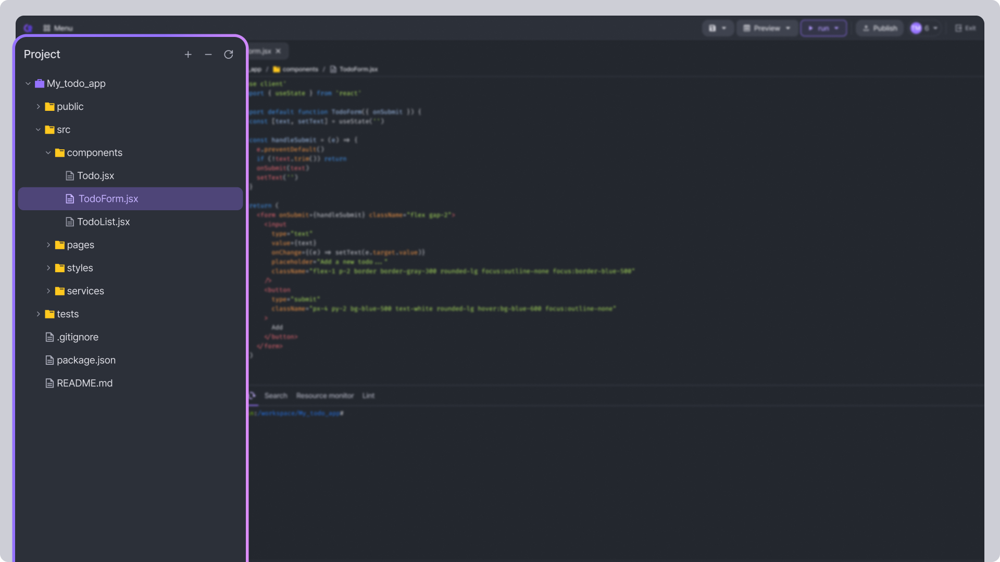
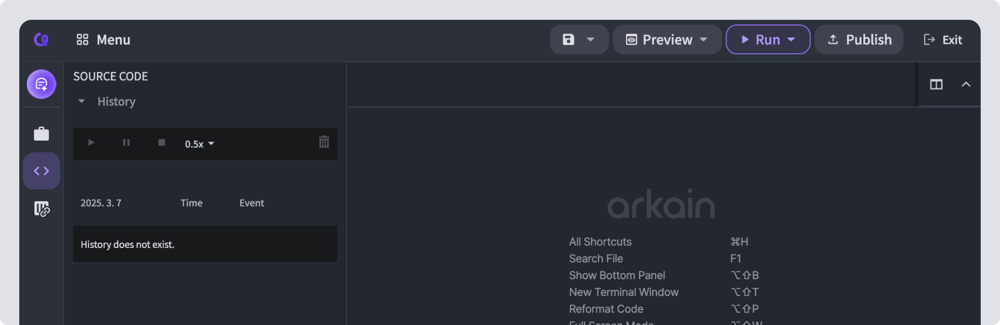
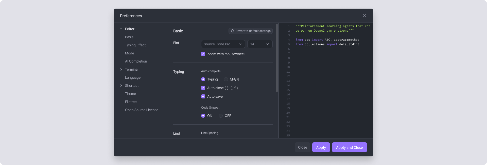
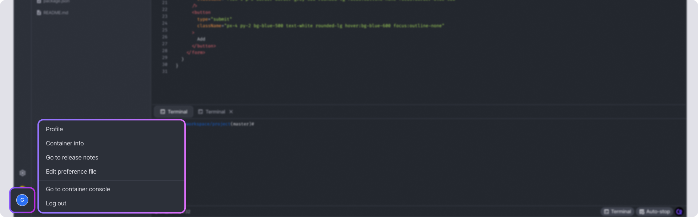
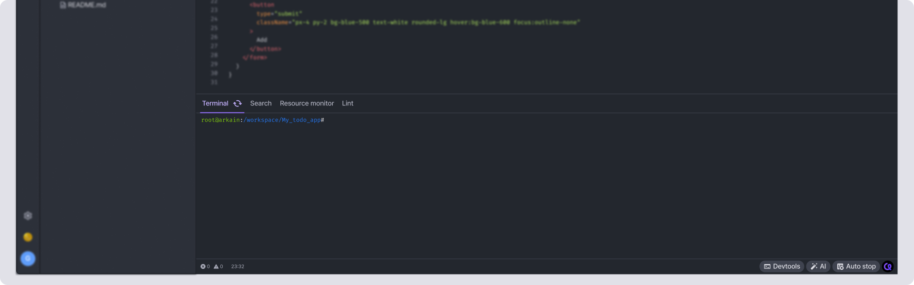
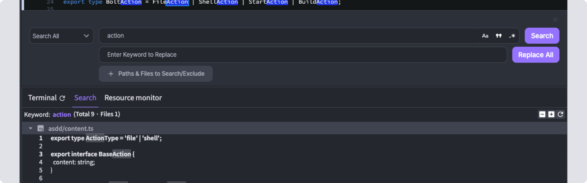
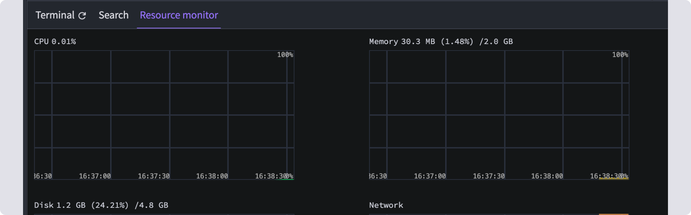

# Workspace

Arkain's **Workspace** is an IDE (Integrated Development Environment) designed to help you efficiently develop software. It provides features such as editing, building, testing, and deploying software. The key area terms of the Workspace are as follows.



***

## Menu bar 

<figure><figcaption></figcaption></figure>

The Menu bar is where you perform general operations on your Arkain Workspace. It includes, from left to right

* The **\[Menu]** button() of the menu bar allowing users to Process list, SSH Configuration, Manage SBOM, and New Terminal Window.

<figure><figcaption></figcaption></figure>

* The **\[Save]** button() allows you to save the open file, save as a new name, or save all files.
* The **\[Preview]** button() allows users to preview their project within the Workspace or in a new tab or Workspace. It also provides options for configuring the execution URL and port settings.

<figure><figcaption></figcaption></figure>

* The **\[Run]** button () allows users to manage and execute custom run commands they have written.

<figure><figcaption></figcaption></figure>

* The **\[Publish]** () button deploys the currently active container as a template. Deployed templates are made public on the [Templates page](https://arkain.io/template).
* Clicking the **\[Exit Container]** button () will exit the workspace. The container execution will stop upon exit.


**Warnning**\
Even if you close the web browser, the container will remain running. **While the container is running,** [**credits**](../../credits-and-membership/credits/) **will be consumed.** It is recommended to click the **\[EXIT]** button to exit Arkain.


## Activity bar 

The Sidebar is an area that helps you easily access key features needed for development. You can open a different Sidebar by clicking on the icons in the Activity bar.

### &#x20; [Side Chat](../arkain-ai/)

Clicking on **\[Side Chat]** will open a Side Chat on the left side of the Workspace, where you can converse with the **AI Code Assistant**.

<figure><figcaption></figcaption></figure>


[what-is-arkain-snap.md](../arkain-ai/what-is-arkain-snap.md)


###  [Project](./#project-sidebar)

The **\[Project button]** is opens the Project Sidebar area. The project sidebar is a type of file explorer that allows you to create, edit, and delete project files and folders.

You can click to open documents like the Readme, which contains project descriptions, or source code.

<figure><figcaption></figcaption></figure>

#### ➕ **Create Files & Folders**

Click the \[**+] button** to create new **files, folders** and sub projects within your project.

#### **Folder Management**

* Use the  **icon** to collapse or expand all folders.
* Click the  **refresh button** to update the file tree and keep it in sync.

:mouse: **Right-Click for File Actions**

Right-click on a file to access all available file-related features, including renaming, deleting, moving, and more!&#x20;

<figure><figcaption></figcaption></figure>

###  [Git](source-code-management-git/git.md)

It opens Git, a distributed version control system, in the Sidebar to track and synchronize changes to files. **Arkain** provides most of the Git commands.

<figure><figcaption></figcaption></figure>


[git.md](source-code-management-git/git.md)


###  [Source Code](./#source-code-sidebar)

It opens a Sidebar where you can view the source code's hierarchy, bookmarks, and change history.

<figure><figcaption></figcaption></figure>

* **Automatic Save History** \
  Your work sessions are stored as a list, allowing you to restore previous versions easily.
* **Quick Navigation with Bookmarks** \
  Set bookmarks to jump directly to specific points in your code.
* **Replay Your Code Changes**\
  Watch your code edits play back in chronological order, making it easy to review your progress and understand changes over time.

Effortlessly track, revert, and replay your coding journey!&#x20;

###  [Share This Container](./#share-this-container-sidebar)

You can share your container with others to collaborate or showcase your projects. Even if someone doesn't have a Arkain account, they can still access the shared container.

<figure><figcaption></figcaption></figure>


[contaienr-sharing.md](collaboration/contaienr-sharing.md)


###  Help

Here, you can find Arkain's features, view [shortcuts](keyboard-shortcut.md), and access help.

<figure><figcaption></figcaption></figure>

### &#x20; Preference

You can open the project settings modal. You can change the editor, terminal, and theme styles, as well as configure key Arkain features such as **Auto-Completion**.

<figure><figcaption></figcaption></figure>

#### Profile and Container Info

You can navigate to the page where you can manage your **member profile** and **container information**. You can check the available credits along with Container usage time, Estimated uptime, and Used credit.

###  Account

You can navigate to the page where you can manage your member profile and container information.

<figure><figcaption></figcaption></figure>

* **Profile** : You can navigate to the Profile Settings page to edit your profile information.
* **Container Info** : You can navigate to the Container Settings page to configure detailed container settings.
* **Go to Release Notes** : You can check the version-specific changes, added features, improved functionalities, and bugs of the Arkain service in the release notes.
* **Edit Preference File** : You can configure the IDE settings based on files.
* **Go to Dashboard :** You exit the workspace and move to the dashboard.
* **Sign out** : You can log out.

## Editor 

The Editor section of the Workspace displays the content of the currently selected file. You can perform several actions in the Editor's top-right side such as format code with [Prettier](https://prettier.io/) or manage the file tabs if you have several open.

<figure><figcaption></figcaption></figure>

## Toggle Panel 

In Arkain's toggle panel, you can use features such as the terminal, search, and resource monitor.

### Terminal

**Arkain** provides a built-in terminal, so developers who are comfortable with commands can use it to perform advanced tasks.

By default, the terminal is available as the Terminal tab in the toggle Panel of the Arkain interface. To open it in a new terminal window, go to **\[Menu]**() → **\[New Terminal Window]** or press the default shortcut <kbd>Alt</kbd> + <kbd>Shift</kbd> + `T` (macOS <kbd>⌥</kbd> <kbd>⇧</kbd> <kbd>T</kbd>).&#x20;

You can open the Terminal in a new window by right-clicking on a folder or file in the Project Sidebar and clicking the **\[Open Terminal with this location]** menu, which will automatically take you to the folder.

<figure><figcaption></figcaption></figure>


As a docker container-based service, Arkain does not support system privileges for containers due to security policy. Therefore, commands that access system resources such as `ufw`, `systemctl`, `docker`(docker in docker) cannot be used.


### Search

The Search Panel displays search results for all documents within the project. When you change the search scope to 'Search All' in search or replace, the Search Panel will show keyword search results for each file.

<figure><figcaption></figcaption></figure>

### Resource monitor

The resource monitor panel displays the usage of container resources such as CPU, memory, disk, and network in a graphical format.

<figure><figcaption></figcaption></figure>

## Bottom bar 

The bottom bar is an area that provides various tools and information to enhance convenience when using Arkain. It includes the editor's code Lint and Editor information, along with the Toggle Panel, Auto-completion, and Auto-off toggle buttons.

#### Edit Status Area

The Edit Status Area displays linting check results and editor line information. **Lint** is a tool that identifies and notifies errors related to syntax and code style in the source code.&#x20;

The **Edit Status Area** shows, from left to right, the **lint errors**, **lint warnings**, and the total number of lines in the editor along with the current cursor position in the format of 'number:number'.

<figure><figcaption></figcaption></figure>


The lint information is only available in the Python container.


### **Toggle Button**

* **Devtools**: You can open and close the Toggle Panel. Closing the Toggle Panel allows you to focus more on your code.
* **Auto-Completion**: Get smart coding suggestions in real-time.
* **Auto-off**: You can toggle the feature to automatically stop container usage when the browser is closed.
* **Contact us** – Click to open a chat window for direct support.

<figure><figcaption></figcaption></figure>
