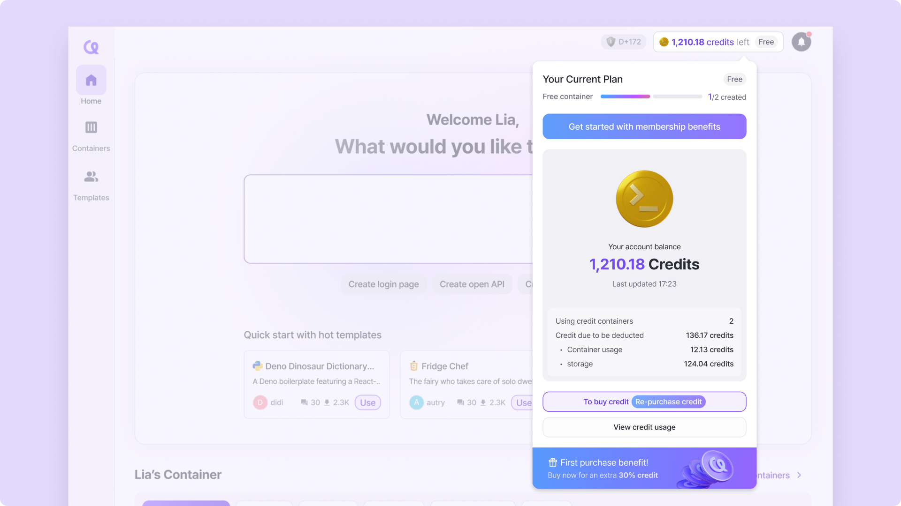

# Studio

This page provides an overview of the terms we use to describe each of the pieces of the user interface (UI) available to you in Arkain projects.

<figure><figcaption>
Studio layout
</figcaption></figure>

***

## Menu Bar 

<figure><figcaption></figcaption></figure>

The Menu Bar is where you perform general operations on your Arkain Workspace. It includes, from left to right

* **\[Function]** button ()of the menu bar allowing users to Process list, SSH settings, SBOM management, and project configurations.

<figure><figcaption></figcaption></figure>

* **\[Save]** button () saves all open files.
* **\[Preview]** button () allows users to preview their project within the workspace or in a new tab. It also provides options for configuring the execution URL and port settings.

<figure><figcaption></figcaption></figure>

* **\[Run]** button () allows users to manage and execute custom run commands they have written.

<figure><figcaption></figcaption></figure>

* **\[Create Template]** () button deploys the currently active container as a template.
* Clicking the **\[Exit Container]** button () will exit the workspace and return to the dashboard. The container execution will stop upon exit.

***

## Activity Bar 

In the Activity Bar, you can select and use various sidebars.

#### &#x20; Side Chat : opens Side Chat

An intelligent **AI code assistant** is available in Arkain's 'Side Chat' area to interact with your code.

<figure><figcaption></figcaption></figure>


[how-to-use-side-chat.md](../side-chat-ai-code-assistant/how-to-use-side-chat.md)


####  [Project : opens the Project sidebar](./#project-sidebar)

####  [Command : opens the Command sidebar](./#command-sidebar)

####  [Git : opens the Git sidebar](./#git-opens-the-git-sidebar)

####  [Source Code : opens the Source Code sidebar](./#source-code-opens-the-source-code-sidebar)

####  [Share This Container : opens the Share This Container sidebar](./#share-this-container-opens-the-share-this-container-sidebar)

####  Help : You can access various **help documents** for assistance.

<figure><figcaption></figcaption></figure>

* **Find Menu** : You can invoke the **Quick Execute** feature.

<figure><figcaption></figcaption></figure>

* **arkain Service Center** : You can open the messenger for contacting **Customer Support**.
* **View All Shortcut** : You can view the **shortcut keys for the entire IDE**.


[keyboard-shortcut.md](keyboard-shortcut.md)


####  Preference : You can open the **project settings modal**.

<figure><figcaption></figcaption></figure>

####  Credit : You can check the available credits along with Container usage time, Estimated uptime, and Used credit.

####  Account : You can navigate to the page where you can manage your **member profile** and **container information**.

<figure><figcaption></figcaption></figure>

* **Profile** : You can navigate to the **Profile Settings** page to edit your profile information.
* **Container Info** : You can navigate to the **Container Settings** page to configure detailed container settings.
* **Go to Release Notes**
* **Edit Preference File** : You can configure the **IDE settings** based on files.
* **Go to Container Dashboard**
* **Sign out** : You can **log out** and return to the **main page**.

***

## Sidebar 

When you open a Arkain project, the Sidebar defaults to the _Project_ icon's expanded view. You can open a different Sidebar by clicking on the icons in the Activity Bar.

#### ➡️ Project Sidebar

The **Project Sidebar** includes the project description (if provided by the author) and allows you to **browse project files**.

You can also **create, edit, and delete files** related to the project directly from the Project Sidebar. 🚀

<figure><figcaption></figcaption></figure>

#### ➕ **Create Files & Folders**

#### Click the \[**+] button** to create new **files and folders** within your project.

#### 📂 **Folder Management**

* Use the **\[-] icon** to collapse or expand all folders.
* Click the **refresh button** to update the file tree and keep it in sync.

<figure><figcaption></figcaption></figure>

#### 🖱 **Right-Click for File Actions**

Right-click on a file to access all available **file-related features**, including **renaming, deleting, moving, and more**! 🚀

### ➡️ Git Sidebar

**Arkain** provides most of the Git commands.\
When you click the .png>)**\[Git icon]** in Arkain's activity bar, you can manage source code versions with Git.

<figure><figcaption></figcaption></figure>


[git.md](source-code-management-git/git.md)


### ➡️ Source Code Sidebar

<figure><figcaption></figcaption></figure>

💾 **Source Code Sidebar**

* **Automatic Save History** 📜\
  Your **work sessions are stored** as a list, allowing you to **restore previous versions** easily.
* **Quick Navigation with Bookmarks** 🔖\
  Set bookmarks to jump directly to specific points in your code.
* **Replay Your Code Changes** ⏪▶️\
  Watch your **code edits play back in chronological order**, making it easy to review your progress and understand changes over time.

Effortlessly **track, revert, and replay** your coding journey! 🚀

### ➡️ Share This Container Sidebar

You can share your container with others to collaborate or showcase your projects. Even if someone doesn't have a Arkain account, they can still access the shared container.

<figure><figcaption></figcaption></figure>


[contaienr-sharing.md](collaboration/contaienr-sharing.md)


***

## Editor 

The Editor section of the IDE displays the content of the currently selected file. You can perform several actions in the Editor's top-right side such as format code with [Prettier](https://prettier.io/) or manage the file tabs if you have several open.

<figure><figcaption></figcaption></figure>

***

## Terminal 

**Arkain** provides a built-in terminal, so developers who are comfortable with commands can use it to perform advanced tasks.

By default, the terminal is available as the Terminal tab in the bottom layout of the Arkain interface. To open it in a new window, go to **\[Window]** → **\[New Terminal Window]** or press the default shortcut **`Alt + Shift + T (Mac: ⌥⇧T)`**.

A new terminal window will appear in your workspace. The terminal window does not persist when you refresh Arkain.

You can open the Terminal in a new window by right-clicking on a folder in the Project Sidebar and clicking the **\[Open Terminal with this location]** menu, which will automatically take you to the folder.

<figure><figcaption></figcaption></figure>


As a docker container-based service, Arkain does not support system privileges for containers due to security policy. Therefore, commands that access system resources such as **`ufw, systemctl, docker`**(docker in docker) cannot be used.


***

## Bottom Bar 

<figure><figcaption></figcaption></figure>

⚡ **Bottom Bar Features**

The **Bottom Bar** includes icon buttons for:

* 🖥 **Terminal** – Open and manage your terminal sessions.
* 🤖 **AI Code Completion** – Get smart coding suggestions in real-time.
* ⏹ **Container Automatic Stop** – Manage automatic container shutdown settings.
* 💬 **1:1 Support Chat** – Click to open a chat window for direct support.

<figure><figcaption></figcaption></figure>

Each button works as a **toggle**, allowing you to easily show or hide features as needed. **Clicking the 1:1 support button opens a chat window where you can ask questions in real time.** 🚀

