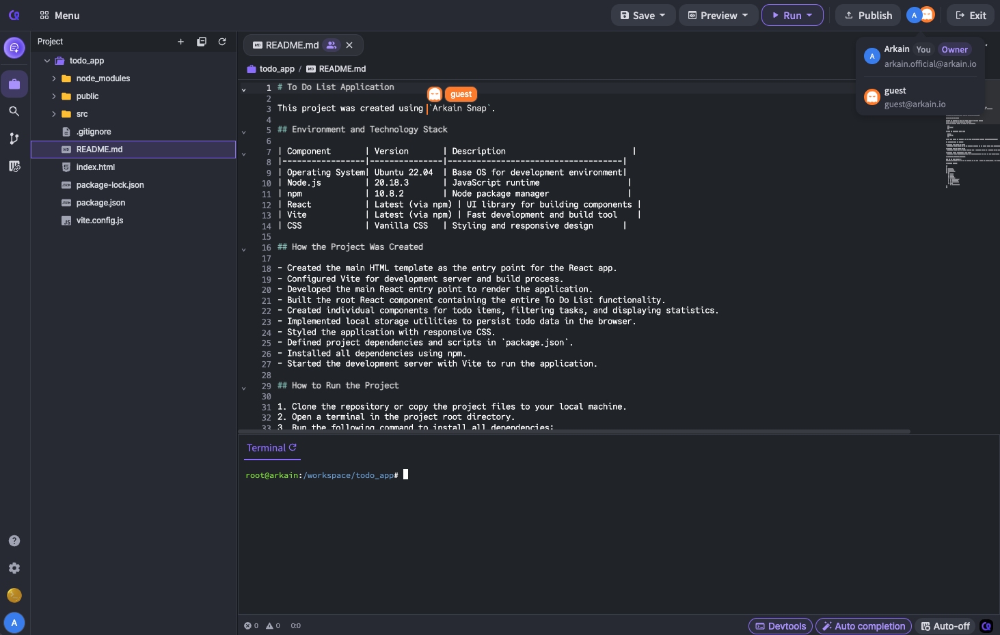

# Co-Editing

If another user has the same file open, a violet indicator() appears on the right side of the editor tab, indicating that someone else is viewing or editing it.

Additionally, the name of that user is displayed at the cursor position, allowing real-time tracking of the editing status. The cursor color matches the background or border color of the user’s Profile Image, which appears in the top-right corner of the Workspace.

<figure><figcaption></figcaption></figure>

