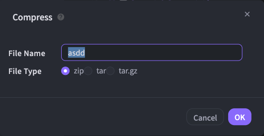
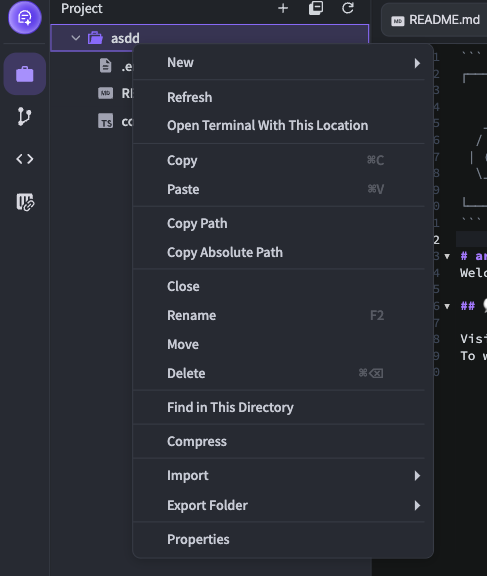
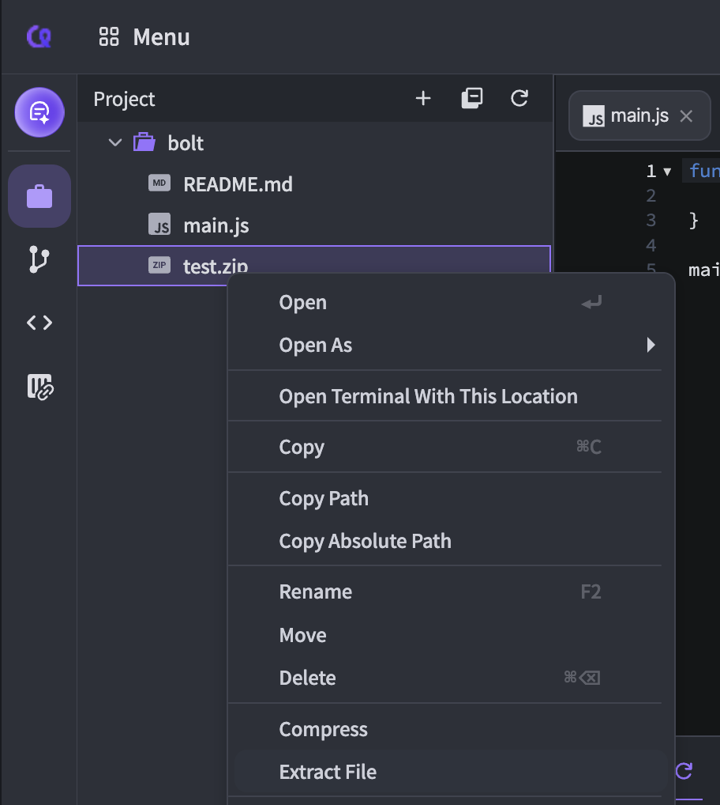

# Compress/Extract File

If you want, you can compress a folder within the project to save storage space. Conversely, you can also extract compressed files.

## 1. Compress

❶ Right-click on a folder in the project sidebar and select **\[Compress]**.

❷ Enter the compressed file name, select the extension, then click **\[OK]** to compress the folder.

<figure><figcaption></figcaption></figure> <figure><figcaption></figcaption></figure>


Arcane only supports **ZIP**, **TAR**, and **TAR.GZ** compression formats.


## 2. Extract File

❶ In the compressed file of the project sidebar, right-click and click **\[Extract File]**.

❷ When you click the **\[Yes]** button in the popup, the files will be extracted.&#x20;

You can also extract a compressed file by double-clicking it in the Project Sidebar.

<figure><figcaption></figcaption></figure>

<figure><figcaption></figcaption></figure>

<figure><figcaption></figcaption></figure>
