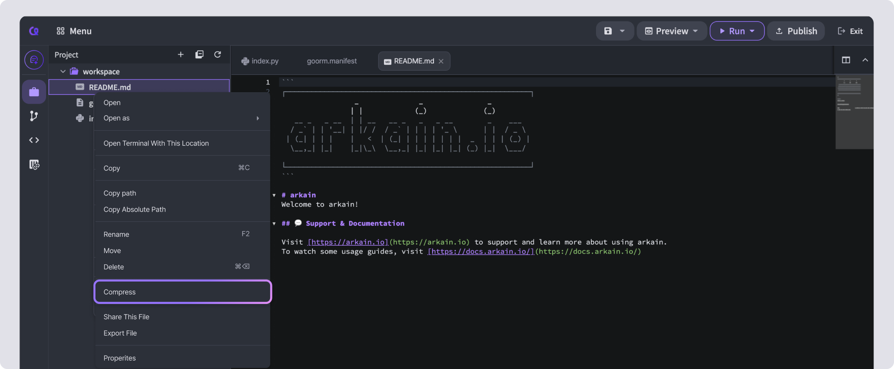
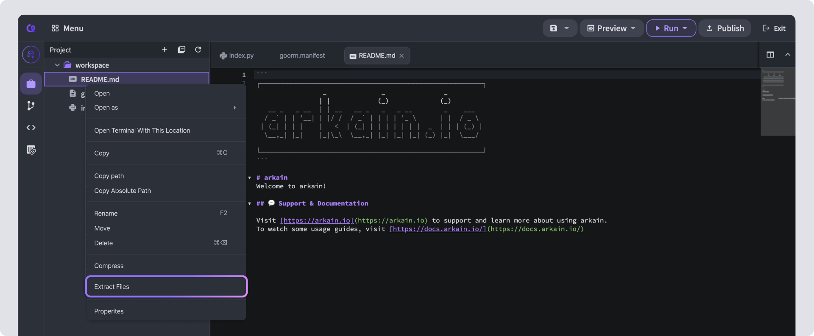

# Compress / Extract File

## Compress



Right-click on a folder in the Project Sidebar and select **\[Compress]**.



Enter the compressed file name, select the extension, then click **\[OK]** to compress the folder.



<figure><figcaption></figcaption></figure>

<figure><figcaption></figcaption></figure>


Arkain only supports **ZIP**, **TAR**, and **TAR.GZ** compression formats.


## Extract File&#x20;



In the compressed file of the Project Sidebar, right-click and click **\[Extract File]**.



When you click the **\[Yes]** button in the popup, the files will be extracted. You can also extract a compressed file by double-clicking it in the Project Sidebar.



<figure><figcaption></figcaption></figure>
