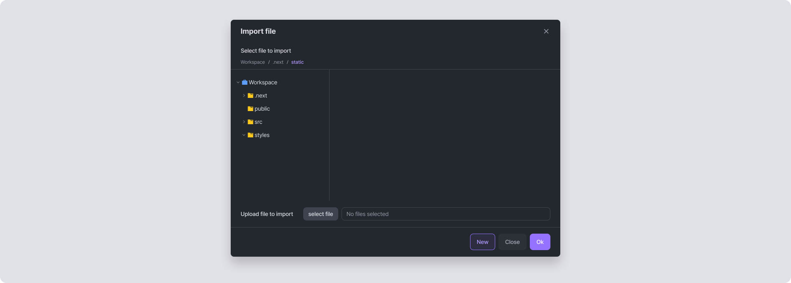
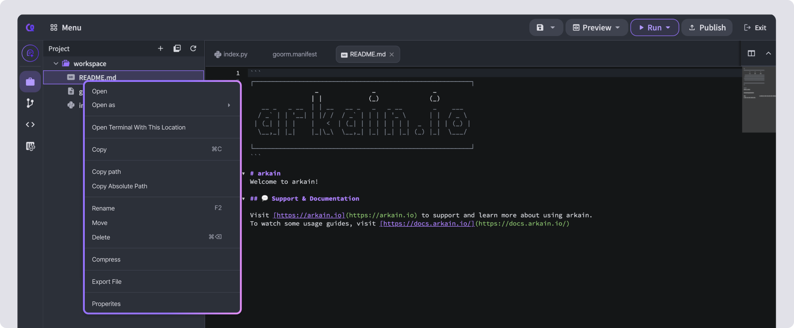
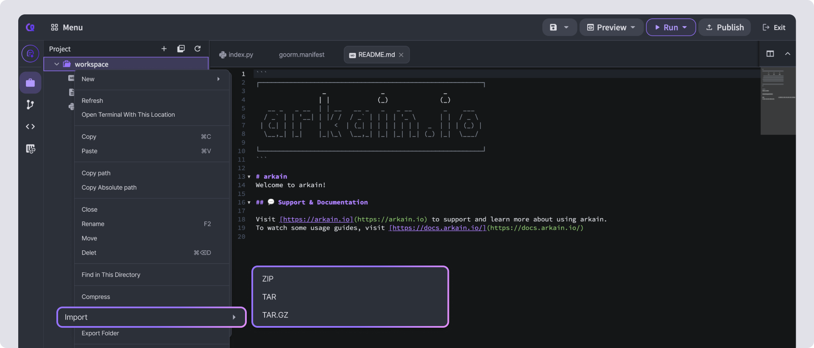

# File import/export

Download files created in Arkain to your computer, or upload files from your computer to Arkain. Arkain also supports uploading folders.

## **1. Import File**

Upload a file from your computer to Arkain. Files with special characters other than Latin alphabets cannot be uploaded. To upload a file:

❶ Right-click on an empty area in the Project sidebar and select **\[Import File]**.

❷ In the Import File pop-up window, upload the file, select the desired location, and click the **\[OK]** button to upload it.

<figure><figcaption></figcaption></figure>

## **2. Export File** 

You can download Arcane's project files to your local system using the **Export File** feature.

❶ Right-click on the desired file in the project sidebar and select **\[Export File]**.

❷ Click **\[Yes]** to download the file to your local system.

<figure><figcaption></figcaption></figure>

<figure><figcaption></figcaption></figure>

## **3. Export Folder** 

Download a folder from Arkain to your computer. To download:

❶ Right-click on the desired file in the project sidebar and select **\[Export Folder]**.\
❷ Choose your preferred compression format: ZIP, TAR, or TAR.GZ.

<figure><figcaption></figcaption></figure>

## **4. Share File** 

❶ Right-click the file in the file tree and select \[Share This File].

❷ Right-click on the file you want to share in the project sidebar and select **\[Share this File]**.

❸ Choose one of the **Sharing Options**, copy the **Sharing URL**, and click **OK**.

❹ Open the **Sharing URL** in a web browser to view the shared file in the cloud code viewer.

<figure><figcaption></figcaption></figure>

<figure><figcaption></figcaption></figure>
