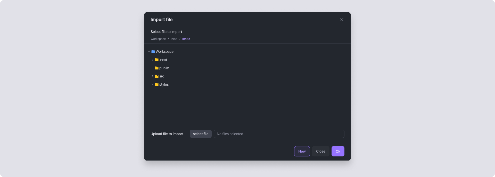
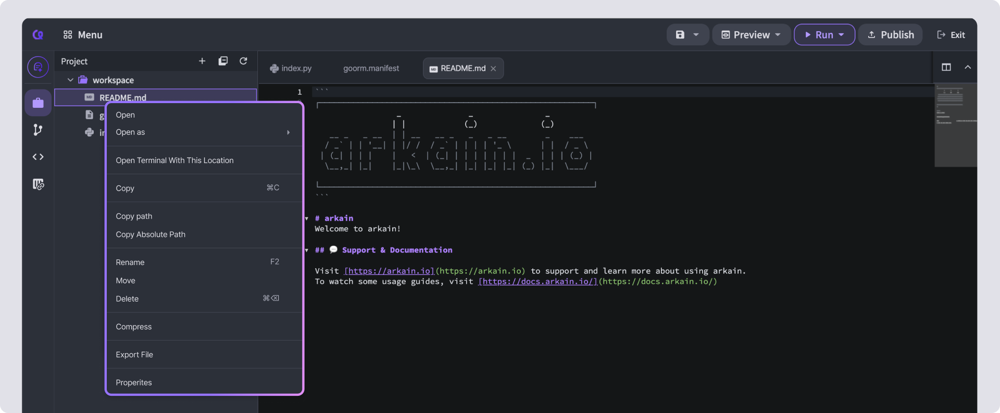
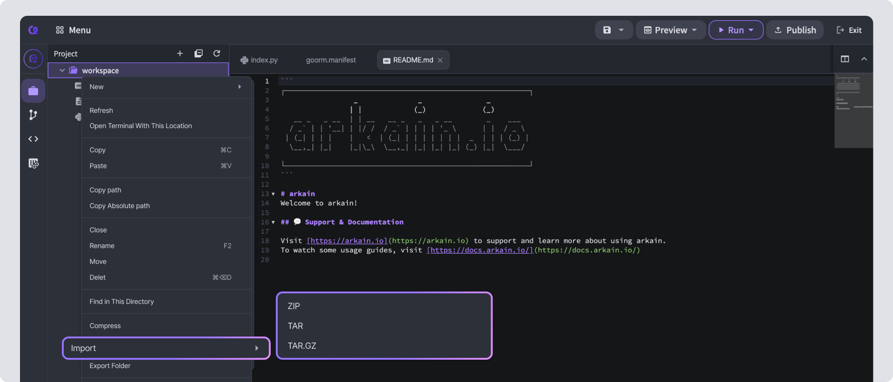

# Import / Export

## **Import File**

Upload a file from your computer to Arkain. Files with special characters other than Latin alphabets cannot be uploaded. To upload a file:



Right-click on an empty area in the Project sidebar and select **\[Import File]**.



In the Import File pop-up window, upload the file, select the desired location, and click the **\[OK]** button to upload it.



<figure><figcaption></figcaption></figure>

## **Export File** 

You can download Arkain's project files to your local system using the **Export File** feature.



Right-click on the desired file in the project sidebar and select **\[Export File]**.



Click **\[Yes]** to download the file to your local system.



<figure><figcaption></figcaption></figure>

## **Export Folder** 

Download a folder from Arkain to your computer. To download:



Right-click on the desired file in the project sidebar and select **\[Export Folder]**.



Choose your preferred compression format: ZIP, TAR, or TAR.GZ.



<figure><figcaption></figcaption></figure>

## **Share File** 



Right-click the file in the file tree and select **\[Share This File]**.



Right-click on the file you want to share in the project sidebar and select **\[Share this File]**.



Choose one of the **Sharing Options**, copy the **Sharing URL**, and click **OK**.



Open the **Sharing URL** in a web browser to view the shared file in the cloud code viewer.



<figure><figcaption></figcaption></figure>

<figure><figcaption></figcaption></figure>
