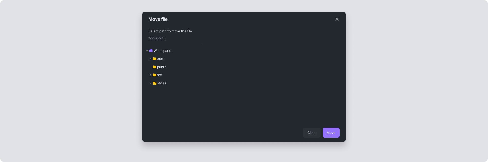

# Move

Move is a function that allows you to move files or folders from their current location to a desired location. In Arkain's project sidebar, select the file/folder you want, right-click, and choose \[Move] to relocate it.



Select the file or folder you want to move in the project sidebar.



Right-click and select **\[Move]** from the menu.



In the newly opened **Move file** window, select the desired location in the file tree and click **\[OK]**.



The file or folder will be moved to the specified location.


Please be careful. If there is a file or folder with the same name in the destination, it will be overwritten.




<figure><figcaption></figcaption></figure>
