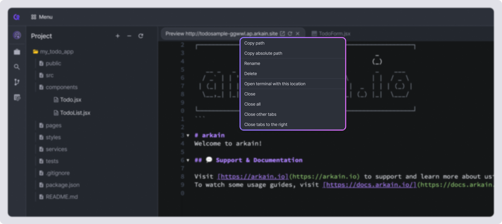

# Open / Close in Editor

In Arkain's Project Sidebar, you can open source code files using the editor. Arkain offers a standard Default Editor along with Vim Editor, Emacs Editor, and Emmet Editor.

## Default Editor

The Default Editor is a text editor that can be opened within the editor section. To open a file, double-click the file you want to open in the Project Sidebar or right-click and go to **\[Open]** or **\[Open As]** → **\[Default Editor]**.

Alternatively, press the default shortcut <kbd>**Ctrl**</kbd>**&#x20;+&#x20;**<kbd>**O**</kbd> (macOS <kbd>⌘</kbd> <kbd>O</kbd>). In the 'Open File' pop-up window that appears, select the file and press the **\[OK]** button to open it.&#x20;

Depending on the file's extension, it may open in the default editor, or it may open in a document viewer. Some unsupported file extensions cannot be opened.

<figure><figcaption></figcaption></figure>

## Vim Editor 

In addition to the Default editor, Arkain also provides a Vim editor. When you open a file with the Vim Editor, it will open within the same Editor section where the Default Editor was previously displayed.

The Vim Editor can be accessed by right-clicking the target file in the Project Sidebar, selecting **\[Open with]** → **\[Vim Editor]**. While the Vim Editor appears similar to the Default Editor, it allows you to edit and save files using Vim commands.

You can open Emacs Editor and Emmet Editor in the same way.

<figure><figcaption></figcaption></figure> <figure><figcaption></figcaption></figure>

## Close 

Files opened in the Editor section can be closed by clicking the **\[X]** button on the tab of each file. Alternatively, you can press the default keyboard shortcut <kbd>Alt</kbd> + <kbd>X</kbd> (Mac: <kbd>⌥</kbd> <kbd>X</kbd>) to close the open file.

You can also right-click a file tab in the Editor section and select \[**Close]** to close that specific file tab. Selecting **\[Close All]** will close all open file tabs.

<figure><figcaption></figcaption></figure>

