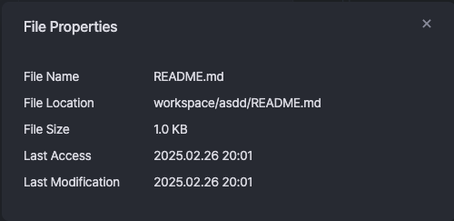
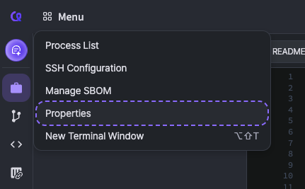

# Properties

**Properties** are a feature that allows you to view detailed information about objects such as projects, files, and folders and modify their settings.

In the project sidebar, you can select the desired file or folder, right-click, and then click **\[Properties]** to view its properties.

To check the project properties, go to **\[Menu]** → **\[Properties]**.

<figure><figcaption></figcaption></figure> <figure><figcaption></figcaption></figure>

