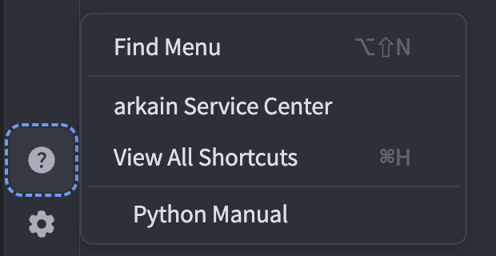

# Introduction to the Workspace

This page provides an overview of the terms we use to describe each of the pieces of the user interface (UI) available to you in Arkain projects.

<figure><figcaption>
Arkain Workspace User Interface
</figcaption></figure>

***

## Menubar 

<figure><figcaption>
Arkain Workspace Menu Bar
</figcaption></figure>

The Menu Bar is where you perform general operations on your Arkain Workspace. It includes, from left to right

* The function buttons on the left side of the menu bar are dedicated to file-related operations. They allow users to create, copy, delete, rename, and save files, providing a streamlined file management experience.

<figure><figcaption></figcaption></figure>

If you'd like to explore additional file-related features, please check the link below:


[file-management](file-management/)


* The central section of the menu bar handles URL and port management, allowing users to manage running URLs, ports, SSH settings, SBOM management, and project configurations.

<figure><figcaption></figcaption></figure>

* The **Preview** tab allows users to preview their project within the workspace or in a new tab. It also provides options for configuring the execution URL and port settings.

<figure><figcaption></figcaption></figure>

* The **Run** menu allows users to manage and execute custom run commands they have written.

<figure><figcaption></figcaption></figure>

* It also includes a **file-saving** feature and an **"Exit Container"** button, which allows users to switch from the workspace to the console.

***

## Activitybar 

The Activity Bar allows you to select a view to display in the sidebar from the available:

#### ➡️ Side Chat : opens Side Chat

We’re thrilled to unveil **AI Code Assistant : Arkain**, an intelligent feature in our webIDE that lets you interact with your code like never before!&#x20;


[side-chat.md](../ai-code-assistant-arkain/side-chat.md)


#### ➡️ [Project : opens the Project sidebar](introduction-to-the-workspace.md#project-sidebar)

#### ➡️ [Command : opens the Command sidebar](introduction-to-the-workspace.md#command-sidebar)

#### ➡️ [Git : opens the Git sidebar](introduction-to-the-workspace.md#git-opens-the-git-sidebar)

#### ➡️ [Debug : opens the Debug sidebar](introduction-to-the-workspace.md#debug-sidebar)

#### ➡️[ Source Code : opens the Source Code sidebar](introduction-to-the-workspace.md#source-code-opens-the-source-code-sidebar)

#### ➡️ [Share This Container : opens the Share This Container sidebar](introduction-to-the-workspace.md#share-this-container-opens-the-share-this-container-sidebar)

#### ➡️ Help&#x20;

#### You can access various **help documents** for assistance.

<figure><figcaption></figcaption></figure>

* Find Menu : You can invoke the **Quick Execute** feature.

<figure><figcaption></figcaption></figure>

* &#x20;**Arkain service center** : You can open the messenger for contacting **Customer Support**.
* **View All Shortcut** : You can view the **shortcut keys for the entire IDE**.


[keyboard-shortcut.md](keyboard-shortcut.md)


* Language documentation : You can navigate to the official online documentation for the created **container stack**.

#### ➡️ Preference

You can open the **project settings modal**.

<figure><figcaption></figcaption></figure>

#### ➡️ Profile and Container Info

You can navigate to the page where you can manage your **member profile** and **container information**.

<figure><figcaption></figcaption></figure>

* **Profile** : You can navigate to the **Profile Settings** page to edit your profile information.
* **Container Info** : You can navigate to the **Container Settings** page to configure detailed container settings.
* **Go to Release Notes**
* **Edit Preference File** : You can configure the **IDE settings** based on files.
* Go to Container Dashboard
* **Sign out** : You can **log out** and return to the **main page**.

***

## Sidebar 

When you open a Arkain project, the Sidebar defaults to the _Project_ icon's expanded view. You can open a different view by clicking on the icons in the Activity Bar.

#### ➡️ Project Sidebar

The **Project Sidebar View** includes the project description (if provided by the author) and allows you to **browse project files**.

You can also **create, edit, and delete files** related to the project directly from the sidebar. 🚀

<figure><figcaption></figcaption></figure>

#### ➕ **Create Files & Folders**

#### Click the **“+” button** to create new **files and folders** within your project.

#### 📂 **Folder Management**

* Use the **“-” icon** to collapse or expand all folders.
* Click the **refresh button** to update the file tree and keep it in sync.

<figure><figcaption></figcaption></figure>

#### 🖱 **Right-Click for File Actions**

Right-click on a file to access all available **file-related features**, including **renaming, deleting, moving, and more**! 🚀

### ➡️ Command Sidebar

### ➡️ Git Sidebar

### ➡️ Debug Sidebar

### ➡️ Source Code Sidebar

### ➡️ Share This Container Sidebar

***

## Editor 

The Editor section of the IDE displays the content of the currently selected file. You can perform several actions in the Editor's top-right side such as format code with [Prettier](https://prettier.io/) or manage the file tabs if you have several open.

<figure><figcaption></figcaption></figure>

***

## Terminal 

**Arkain** provides a built-in terminal, so developers who are comfortable with commands can use it to perform advanced tasks.

By default, the terminal is available as the Terminal tab in the bottom layout of the goormIDE interface. To open it in a new window, go to **\[Window] > \[New Terminal Window]** or press the default shortcut **`Alt + Shift + T (Mac: ⌥⇧T)`**.

A new terminal window will appear in your workspace. The terminal window does not persist when you refresh goormIDE.

You can open the Terminal in a new window by right-clicking on a folder in the Project Explorer and clicking the **\[Open Terminal with this location]** menu, which will automatically take you to the folder.

<figure><figcaption></figcaption></figure>


As a docker container-based service, goormIDE does not support system privileges for containers due to security policy. Therefore, commands that access system resources such as **`ufw, systemctl, docker`**(docker in docker) cannot be used.


***

## Bottombar 

*

***

## Side Chat 

*
