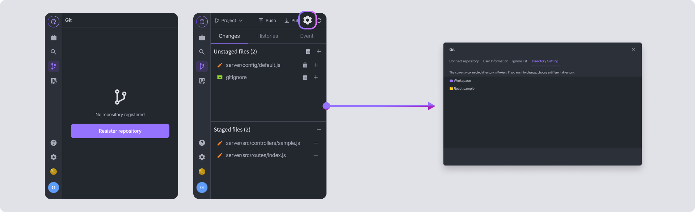

# Multi Project



In the **Project Sidebar**, press the **\[+]** icon and select the **\[New Sub project]** button.



Enter the project name you want to use and click the **\[Create new sub project]** button to create a new project with the same environment as your existing project.




Sub projects can only have the same base template as the main project.


### Git integration 



Click the **\[Register repository]** button on the Git Sidebar, or click the **\[Settings]** icon () on the top right to display the Git Sidebar.&#x20;



In the Git settings popup, you can enter the **\[Directory Setting]** tab and select a folder to integrate Git. From here, you can select the desired subproject and connect the repository to use Git in the subproject.



<figure><figcaption></figcaption></figure>


Before setting the directory, you need to run `git init` or run **Git clone** on the **\[Preference]** tab to get the Change button when you select the folder.

