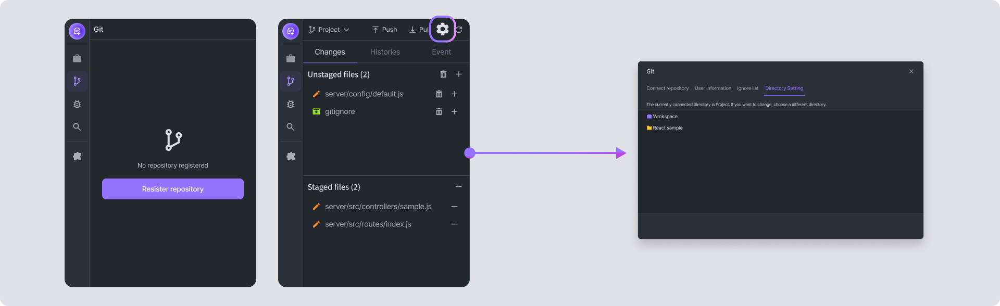

# Multi Project

Multi-project is the feature to work on multiple projects in a single container.

### Creation 

In the Project Sidebar on the right, press the **\[+]** icon and click the **\[New Sub project]** button.

Enter the project name you want to use and click the **Create New Sub project** button to create a new project with the same environment as your existing project.

<figure><figcaption></figcaption></figure>

<figure><figcaption></figcaption></figure>


Sub projects can only have the same stack and the same templates as the main project.


### Setting 

To set build options, click **\[Function]** button () → **\[Properties].**

<figure><figcaption></figcaption></figure>


Please refer to [Build setting for each stack](https://help.goorm.io/en/goormide/getting-started/build#build-settings-for-each-stack)


### Git integration 

Click the **\[Register repository]** button on the Git sidebar, or click the **\[Directory settings]** icon () on the top right to display the Git sidebar. In the Git settings window, you can enter the **\[Directory Settings]** tab and select a folder to integrate Git. From here, you can select the desired subproject and connect the repository to use Git in the subproject.

<figure><figcaption></figcaption></figure>


Before setting the directory, you need to run `git init` or run **Git clone** on the **\[Repository Registration]** tab to get the Change button when you select the folder.

