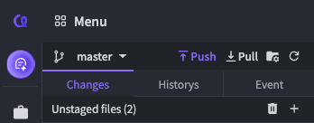
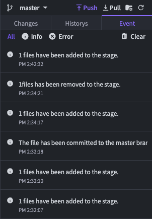
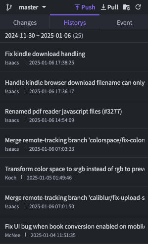

# Changes, Historys, Event

Check the revision status of the current project files/folders in the Changes, Historys, Event tab of the Git Sidebar. You can use key Git commands such as **Add, Commit, Push, Pull,** and **Ignore** here.

In the **Changes tab**, you can easily see whether a file is staged or unstaged at a glance. Click the + or trash can icon next to 'Unstaged files' to change the file status to staged or unstaged.

<figure><figcaption></figcaption></figure>

In the **Historys tab**, you can view commit history, and in **Event tab**, you can check Git events.

<figure><figcaption></figcaption></figure> <figure><figcaption></figcaption></figure>

