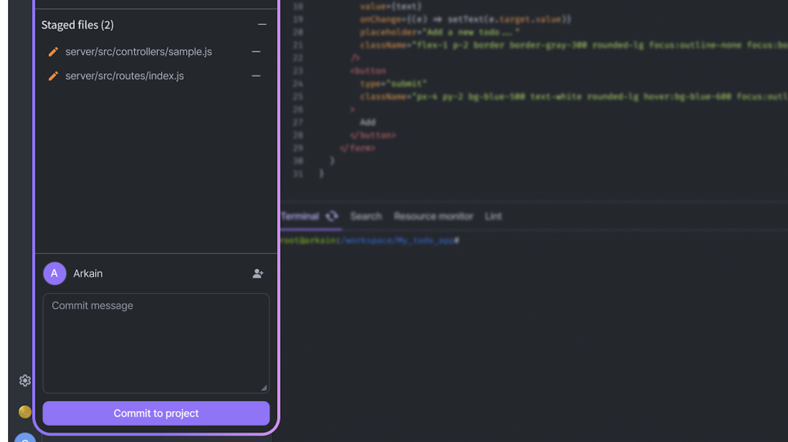

# Commit



Change the status of the files to staged files and write the commit message in the 'Commit message' at the bottom of the Git Sidebar.&#x20;



Clicking the **\[Commit to master]** button will record the changes of the staged files.



<figure><figcaption></figcaption></figure>

Committed files are deleted from the Staged files list. If there are commits that have not been pushed, the **\[Push]** button on the top of the Git Sidebar is activated.

<figure><figcaption></figcaption></figure>
