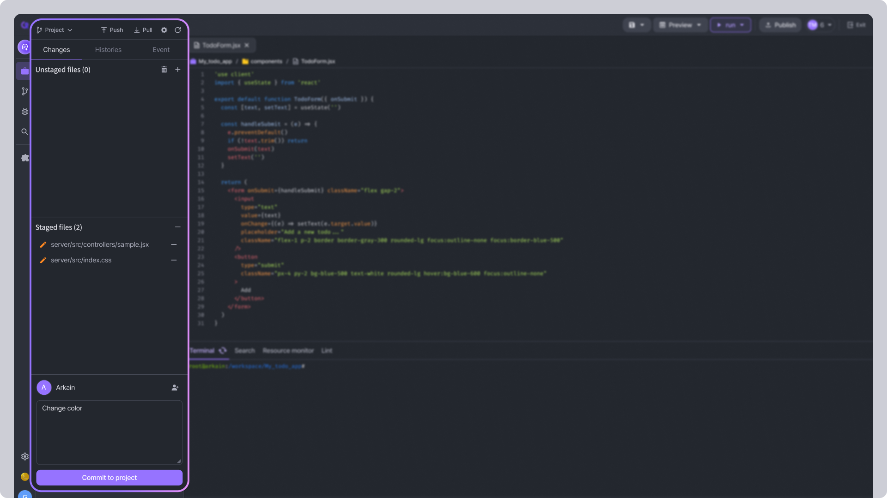

# Commit

### Commits the selected files/folders to local storage.

Enter a commit message in the "Commit Message" window located at the bottom of the Git Sidebar, Click the \[**Commit to master]** button to commit. (The commit message is required.)

<figure><figcaption></figcaption></figure>

Committed files are deleted from the "Staged Files" list. If there are commits that have not been pushed, the **`Push`** button on the top right of the **\[Source Code Management]** layout is activated.

<figure><figcaption></figcaption></figure>
