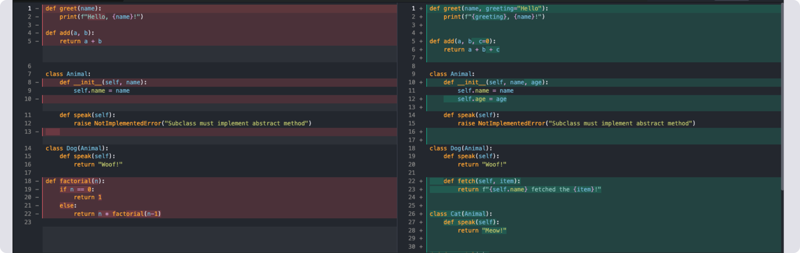
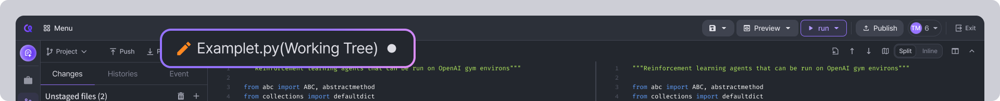
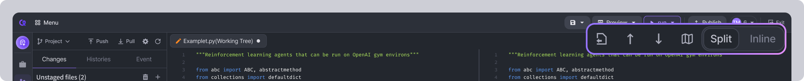

# Diff

## How to use Diff 

Clicking a file in the Unstaged files or Staged files list in the Git Sidebar will open the Diff tool. You can view the changes in the source code in the editor.

<figure><figcaption></figcaption></figure>


**Note**\
If you open the **\[Git]** tab and there is only a **\[Register repository]** button, you need to connect the repository first. See how to connect on [Import Github Repos](../../dashboard/container/container-management/import-github-repos.md) page.


### **The editor area**

<figure><figcaption></figcaption></figure>

You can compare the source code **before the change (left)** and the source code **after the change (right)**.

In the pre-change source code, **lines of code that were deleted are&#x20;**<mark style="color:red;">**highlighted in red**</mark> and marked with a - next to the line number. In the after-change source code shows the **lines of code that were added with a&#x20;**<mark style="color:green;">**green highlight**</mark> and a + next to the line number.&#x20;

Also, the code that was actually changed is highlighted darker.


**The status of the file determines which source code is compared.**

If you open the Diff Tool from a file that is ‘**off-stage’**, the source code before the change is the source code as of the last commit, and the source code after the change is the source code you are currently working on.

If you open the Diff Tool from a ‘staged file’, the pre-change source code is the source code at the last commit and the post-change source code is the source code at the time it was added to the stage, and modifying the source file does not modify the source code in the Diff Tool.

You can tell which status of the Diff Tool was opened in by looking at the Editor tab. Diff tool opened from `Files Removed from Stage` are named with the original filename followed by _(Working Tree)_, Diff tool opened from `Files Added to Stage` will have the original filename followed by _(Index)_.


<figure><figcaption></figcaption></figure>

### **The button area**

The buttons area in the top right corner of the screen provides 4 functions.

<figure><figcaption></figcaption></figure>

* **Open file:** Opens the Diff Tool's source file editor for the file you are currently viewing.
* **Previous change, Next change**: Moves the cursor to the previous, next change of the current cursor in the source code area after a change.
* **Toggle collapse unchanged regions**: Unchanged source code areas are hidden. If the unchanged source code area is small, it may not be hidden. Click the button one more time to see the full source code again.
* **Change the way the editor area is viewed**: You can change the placement of the source code before changes and the source code after changes. Click the `Split` button to change to a left-to-right orientation, or the `Inline` button to change to a top-to-bottom orientation.
