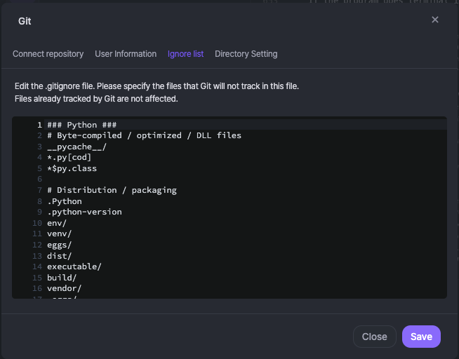

# Ignore

Adding a file to the Ignore will exclude it from version control in the project. Click the **Settings**() button in the top right corner of Git Sidebar, select the **\[ignore list]** tab.

<figure><figcaption></figcaption></figure>

Specify the files you don't want Git to track here. The Ignore command is good for things like error logs or automatically generated files.&#x20;

<figure><figcaption></figcaption></figure>


**if a file is already versioned by Git** (if it has been added to the repository)**, it will not be ignored.** Git already knows about it, so it can't ignore it.

