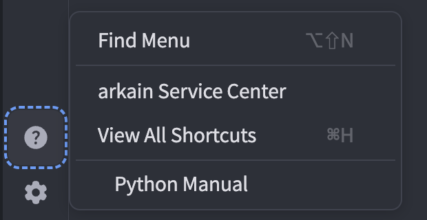

# Apr 17, 2026

## 🌟 Think, Ask, Execute. Arkain Is Officially Here.

Arkain's Open Beta is behind us — and we're launching bigger than ever. This sprint brings Agent-powered Side Chat, MCP tool connections, and a wave of performance and reliability improvements. This is Arkain at its most capable, and we're just getting started.

### Highlights

<figure><figcaption></figcaption></figure>

🚀 **Arkain Is Now Officially Live**

We're thrilled to announce that Arkain's Open Beta has successfully concluded, and our official service is live as of April 17, 2026. Thank you for building with us through the beta — your feedback has been the driving force behind what Arkain is today.

<figure><figcaption></figcaption></figure>

🔌 **Your Tools, Now Connected via MCP**

Connect Notion to Arkain via MCP — the first of many integrations to come. With your documentation connected, turning ideas into working projects has never been faster.

🤖 **Advanced Side Chat Experience**

* **Agent Permissions:** Manage tool and command access in the new Agent Permissions menu. Your permission states and "Approve All" preferences now persist across sessions.
* **Ask Mode:** Replaces 'Chat' mode. Ask mode allows the AI to think through complex questions with deeper context for higher precision.
* **Message Queue:** You can now send new prompts even while a response is in progress. Messages are queued and automatically processed in order once the current response is complete.

🌐 **Arkain Now Speaks Korean**

The entire Arkain interface is now available in Korean. We've added a new in-app language switcher so you can toggle between English and Korean at any time.

***

### Minor Changes

**New Features**

* **New Side Chat Default Model:** Introducing Claude Sonnet 4.6 — now available and set as the default engine for Side Chat, providing superior speed and precision over Sonnet 4.5.
* **Agent Mode Model Support:** GPT-5 Mini, GPT-5 Nano, Claude Haiku 4.5, and Gemini 3 Pro are now available in Agent Mode.

**Changes**

* **Arkain Snap Enhancement**: Now leverages Agent-based execution to improve generation speed and accuracy. It automatically iterates through fixes to ensure successful project generation.
* **Side Chat History Compression:** Added UI indicators for background context optimization to save tokens.
* **Shortcut Update:** Changed the Mode switch shortcut from Cmd+. (Mac) / Ctrl+. (Windows) to Shift+Tab.
* **Workspace UI:** Updated the membership information pop-up to clearly include GPU container benefits.
* **Visual Consistency:** Completed the 2nd-phase design system update across the Workspace for a more polished and unified experience.
* **Container Settings:** Improved the UI for the domain addition dropdown menu.

**Bug Fixes**

* **File System:** Fixed failures in file download, copy, paste, and duplicate operations.
* **Editor:** Fixed file tabs not updating when a file name is changed via terminal commands.
* **Agent Mode:** Fixed interrupted messages not being cleared when tapping 'Retry'.
* **Agent Mode Performance:** Fixed interface lag occurring during exceptionally long Agent conversations.
* **Credit Checkout:** Fixed inaccurate storage billing amounts displayed during credit purchase.
* **Credit Usage Summary:** Fixed a rounding error in the monthly total calculation display. This was a visual summation issue only; actual credit deductions and balances were not affected.
* **Notifications:** Fixed an issue where the notification count did not update correctly when receiving referral credits.

**Deprecated**

* **AI Supporter Discontinued:** Replaced by Agent Mode in Side Chat, which leverages full project context to deliver even better results autonomously.

