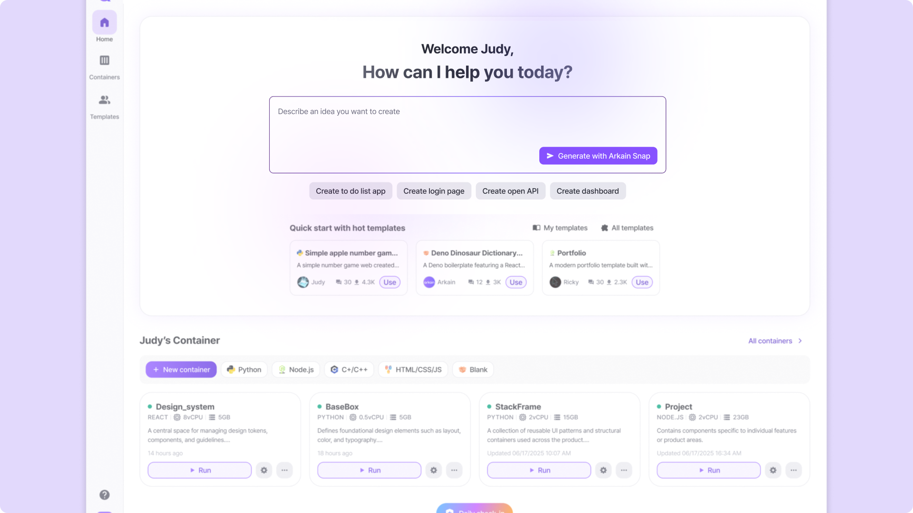
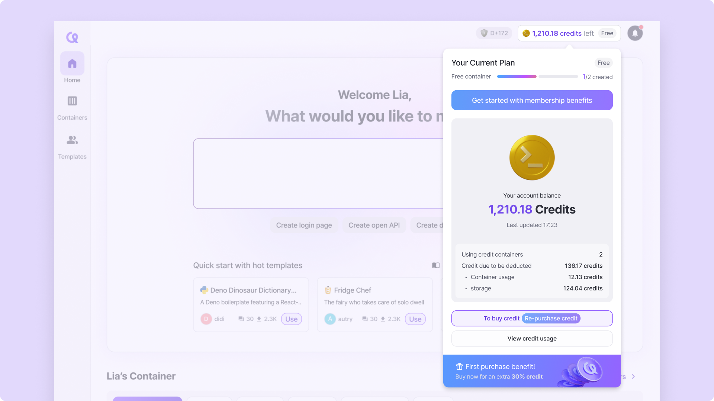

# July 26, 2025

## New Features

<figure><figcaption></figcaption></figure>

* **Snap is now available directly from the dashboard — start your next project with just a prompt.**

## Changes

<figure><figcaption></figcaption></figure>

* The credit panel has been moved into a sleek popover at the top. Track your credit usage, balance and plan at a glance — just click the top-right credit badge.

## Bug Fixes

* Fixed the bug where profile picture would not appear in chat when using Snap.
* Fixed the bug where the UI included guidance related to full screen mode shortcuts.
* Fixed the bug where incorrect colors were applied to the domain addition section in the Settings page.
* Fixed the bug with the Use template modal not closing naturally.
* Fixed the Create Template page not taking up the full height of the browser when opened as a popup.&#x20;
* Fixed the bug where commit message would be wrapped in double quotes when committing with git UI.&#x20;
* Fixed the bug where code generation would fail midway when using Snap.
* Fixed the bug where retry was not possible when LLM response failed.
* Fixed the bug where indents would be forced to be converted to tabs when applying code in Sidechat.
* Fixed the bug that prevented multilingual support when editing the description in container settings page.

