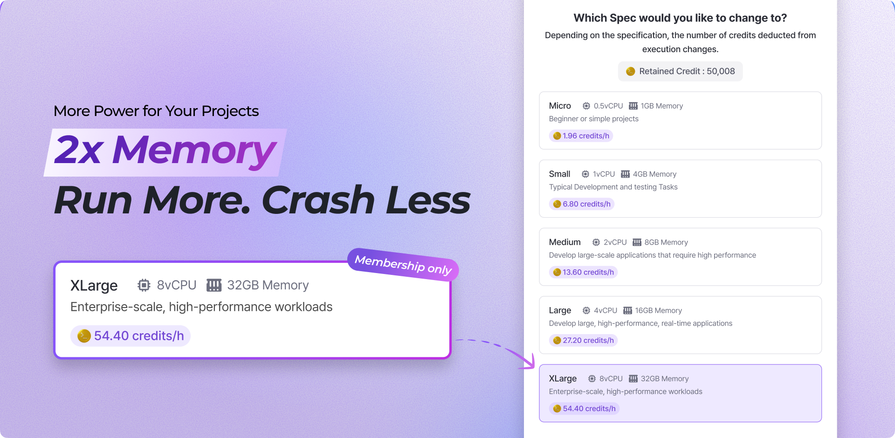

# Mar 10, 2026

## 🚀 Power Up: 2x Memory & New 32GB XLarge

To support your most ambitious AI projects, we’re delivering a significant performance boost. Enjoy **doubled memory** across standard tiers and meet our new powerhouse—the **32GB XLarge tier**.

<figure><figcaption></figcaption></figure>

**⚡ 2x Memory Boost, Same Price**\
We’ve optimized our container specifications to a **1:4 (vCPU to Memory) ratio**. This update doubles your memory capacity for a more stable experience—at no extra cost. (Note: Micro and GPU tiers remain unchanged in this update.)

| Performance   | Previous Spec | Updated Spec (1:4)       | Credits / hr |
| ------------- | ------------- | ------------------------ | ------------ |
| **Small**     | 2 vCPU / 2GB  | **1 vCPU / 4GB Memory**  | 6.80         |
| **Medium**    | 4 vCPU / 4GB  | **2 vCPU / 8GB Memory**  | 13.60        |
| **Large**     | 8 vCPU / 8GB  | **4 vCPU / 16GB Memory** | 27.20        |
| **XLarge** 🌟 | **-**         | **8 vCPU / 32GB Memory** | **54.40**    |

**How to apply:** New containers get this automatically. For existing containers, simply ‘**Restart’** to apply the new specs. Your files and configurations will remain safe.

**✨ New Performance Tier: XLarge (8 vCPU / 32GB)**\
Exclusively for membership users, the **XLarge** tier is purpose-built for heavy-duty AI workloads that demand peak performance:

* **LLM Training:** Efficiently fine-tune and run large language models.
* **Complex Pipelines:** Execute multi-model AI workflows without memory bottlenecks.
* **Massive Data:** Handle high-memory datasets with **32GB of dedicated RAM**.

***

#### **Minor Changes**

**New Features**

* **gemini-3.1-pro Support:** Added gemini-3.1-pro to the list of available models in the Side Chat (Workspace), providing more refined and up-to-date intelligence for your tasks.

**Changes**

* **Email Compliance:** Added company legal names and addresses to the footer of all Arkain system emails for enhanced transparency and regulatory compliance.

**Bug Fixes**

* **Container Settings Page:** Fixed control buttons overlapping the Side Chat (Dashboard) input box on mobile.

**Deprecated**

* **gemini-3.0-pro:** Removed gemini-3.0-pro from the Side Chat (Workspace) model options, officially replaced by the improved 3.1 version.

