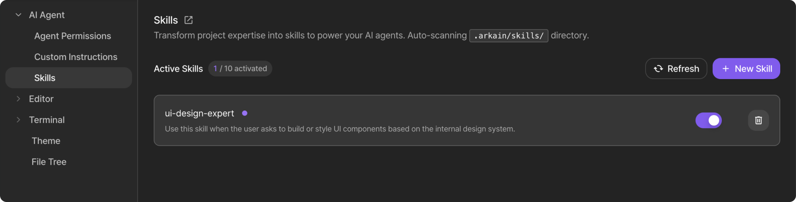

# May 14, 2026

## 🌟 Precision in Every Step

<figure><figcaption></figcaption></figure>

This update brings 5 major capabilities that put you in absolute control. Plan Mode brings strategic thinking, Agent Skills scales your expertise, and Web Fetch adds real-time web knowledge. Combined with Visual Context for Snap and sharpened accuracy, Arkain is now more intentional and precise than ever.

### Highlights

🤖 **Side Chat: Introducing** [**Plan Mode**](../../user-guide/workspace/side-chat-workspace/plan-mode.md)\
Plan Mode introduces a “Think-First” workflow for total confidence. The AI clarifies your intent through interactive questions and generates an Action Plan (.md) for you to view and edit directly in the editor. Once satisfied, click “Approve & Run” to let Agent execute your vision with precision. Experience the new standard for reliable AI coding—available for everyone starting today.

📎 **Visual Context for Snap**

<figure><figcaption></figcaption></figure>

Turn visuals into code! Snap now accepts image attachments, allowing you to bridge the gap between vision and code. Attach a screenshot, mockup, or diagram to your prompt to provide instant visual context. This results in highly accurate project setups that align with your design requirements from the very first run.

🧩 **AI Agent** [**Skills**](../../user-guide/workspace/side-chat-workspace/skills.md)

<figure><figcaption></figcaption></figure>

Define your rules once, apply them everywhere. Manage custom Skill files directly via the UI or the .arkain/skills/ directory. Agent intelligently loads relevant skills based on context—supporting up to 10 active skills simultaneously. Built on the [agentskills.io](http://agentskills.io) open standard, it is fully compatible with skills from Claude Code, Gemini CLI, and more.

🌐 **Agent Web Fetch**\
Agent can now retrieve and reference live web content during task execution. Point it to documentation, API specs, or any public URL to have it apply real-time information to your project. Full control is at your fingertips through the Preferences panel, where you can manage allowed and blocked domains to guide Agent’s browsing.

🏗️ **Snap (Dashboard): Higher Precision & Control**\
Snap is now more accurate and flexible. You can manually edit generated prompts to refine your intent before execution. Enhanced context handling ensures high-quality results even in long sessions, while cleaner response logic eliminates repetitive system messages for a more direct and stable experience.

***

### Minor Changes

**Changes**

* **Side Chat (Workspace) - Mode UI & Visual Feedback:** Redesigned the mode selector into a dropdown menu for Agent, Plan, and Ask modes. Each mode now features a distinct color theme that updates the title gradients and input box UI in real-time, providing instant visual confirmation of your active workflow.
* **Side Chat (Dashboard) - Table Support:** Side Chat now supports table formatting, making complex information and data comparisons much easier to read at a glance.
* **Mobile Layout:** Redesigned Quick Prompts to display in a single, scrollable row on small screens, preventing the list from wrapping and occupying too much vertical space.

**Bug Fixes**

* **Dashboard Input Box Experience:**
  * Fixed paste behavior and cursor positioning when editing text.
  * Enabled Ctrl+Z undo and improved character limit messaging.
  * Fixed character counting inconsistencies across operating systems.
* **Page Stability:** Fixed an intermittent bug that occurred when navigating from the Container Settings page back to the Dashboard.
* **Mobile Experience:** Improved the spacing around the bottom buttons on the Template detail page for a cleaner, more balanced mobile layout.

***
