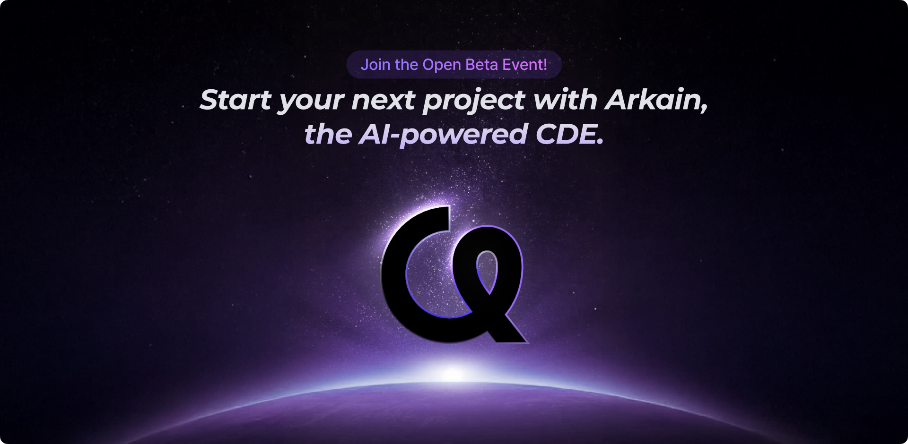
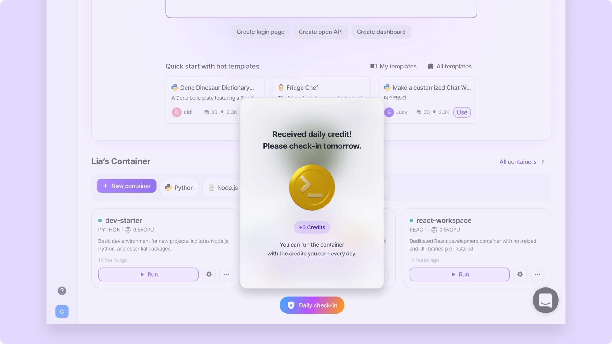

# September 22, 2025

## Highlights

<figure><figcaption></figcaption></figure>

### **✨ The Wait Is Over: Arkain Open Beta Has Arrived!**

Now anyone can join Arkain instantly and start creating without restrictions.

Discover Arkain’s updated pricing and benefits, along with more advanced features designed to elevate your experience.

## New Features

*   🛠️ **AI Supporter & Code Supporter – Now Under Your Control**

    Previously running in the background, these powerful assistants can now be turned on or off as you need.

    * [**AI Supporter**](../../user-guide/arkain-ai/ai-supporter.md)**:** Learns from your project’s context to deliver smarter, more relevant Side Chat responses.
    * [**Code Supporter**](../../user-guide/workspace/editor/code-supporter.md)**:** Enhances your coding with real-time syntax checks, definitions on hover, and language-aware editing support.
* **Template cards now include thumbnail images**, making it easier to spot and recognize your projects instantly.

<figure><figcaption></figcaption></figure>

## Changes

### Credit Benefits & Pricing policy

* Monthly provided credits updated: Free plan from **45 to 50** credits, Membership plan from **135 to 1,000** credits.
* Daily check-in credits increased from **1 to 5** credits.

<figure><figcaption></figcaption></figure>

* For **AI features** such as Side Chat and Arkain Snap, credits are now deducted based on actual usage, with no request limits. For more details, please check this [calculate-credits-usage.md](../../credits-and-membership/credits/calculate-credits-usage.md "mention") documentation.
* The credit deduction amounts for container performance and traffic have been adjusted.

### Templates

* **GPU containers** are now available for creating templates.
* **AI-Generated Template Introduction** feature is now available even when the container is stopped.
* An informational tooltip is now displayed when you try to use the **AI-Generated Template Introduction** feature for a container created in a different region.
* Updated the button name on the Template card: **\[Use]** is now **\[Remix]**.
* Removed the **\[Run Container]** button from the ‘Edit Template’ page.
* Your templates are now discoverable in search engine results.

### Dashboard & Container Sharing

* Moved the **Avatar** dropdown menu from the Sidebar to the Navbar for easier access.

<figure><figcaption></figcaption></figure>

* **Arkain Snap** feature is now available on the Landing page.
* Changed the **Quick Prompt** icon under the Arkain Snap input box on the Dashboard page.
* The **Arkain Domain** input field on the **Container Settings page** now displays the `https://` prefix, preventing errors caused by manually including the protocol.
* The container invitation email now includes the **\[Run]** button that provides a direct link to the container.

### Workspace

* Updated the button names for clarity: **\[Devtools]** is now **\[Terminal]**, and **\[Auto-off]** is now **\[Auto-stop]**.
* The **File Tree** UI has been refined for better readability and easier navigation, making it more convenient to manage your project structure.
* The **Keyboard Shortcuts** set has been refreshed with updated key bindings and improvements for smoother workflows. For more details, please check this [keyboard-shortcut.md](../../user-guide/workspace/keyboard-shortcut.md "mention") document.

## Bug Fixes

### Container Management

* Fixed the bug where the container invitation email was not sent when sharing a container via email.
* Fixed the bug where the container name was not visible in the subject of the container invitation email.
* Fixed the bug where container inactivation due to insufficient credits during storage billing did not work correctly.
* Fixed the bug where reactivating containers created in other regions would fail.
* Fixed the bug where the deletion date of inactive containers was displayed incorrectly.
* Fixed the bug where clicking the tooltip of an inactive container also triggered the \[Reactivate] button.
* Fixed the bug where environment variables could not be set in the Container Settings page.
* Fixed the bug where the storage upgrade input field could exceed the limit for GPU containers.
* Fixed the bug where the container state was not updated correctly after refreshing the page while the container was stopping.
* Fixed the bug where the user's repository was not properly retrieved when creating GitHub-based containers.
* Fixed the bug where containers remained accessible after account deletion.
* Fixed the bug where container descriptions at maximum length overflowed outside the container card.

### Credits

* Fixed the bug where credits were not deducted for excess traffic.
* Fixed the bug where paid credits were deducted before free credits, which prevented a proper refund.
* Fixed the bug where storage usage and time were not displayed correctly on the credit usage page.
* Fixed the bug where the style of the email input field on the Payment page was broken.

### Template

* Fixed the bug where the recommended performance settings were not applied properly when remix templates.
* Fixed the bug where security review was not performed after creating a template.
* Fixed the bug where sorting templates by \[Recent] did not work properly on the Template page.
* Fixed the bug where the scrollbar area inside the dropdown menu appeared transparent on the ‘Create Template’ page.

### Workspace

* Fixed the bug where the terminal would intermittently refresh.
* Fixed the bug where files could not be moved in the Project Sidebar.
* Fixed the bug where file changes were intermittently not reflected in the Project Sidebar.
* Fixed the bug where the AI Supporter searched for related files from an incorrect path.
* Fixed the bug where clicking a search result in Search Sidebar did not open the editor immediately.
* Fixed the bug where the editor did not open immediately after Code Apply.
* Fixed the bug where incorrect error messages were displayed when registering duplicate domains.
* Fixed the bug where the command settings were not applied properly.
* Fixed the bug where the Workspace layout settings reset after refresh or container restart.
* Fixed the bug where the font size in the Side Chat was not applied properly.
* Fixed the bug where the terminal and theme preferences were not applied properly.
* Fixed the UI/UX bug in the pre-stop warning popup (10 minutes before container stops) in light mode.
